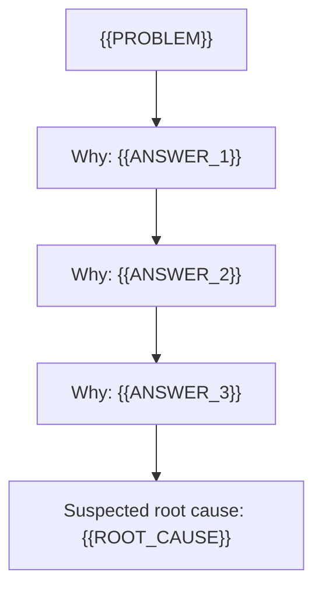
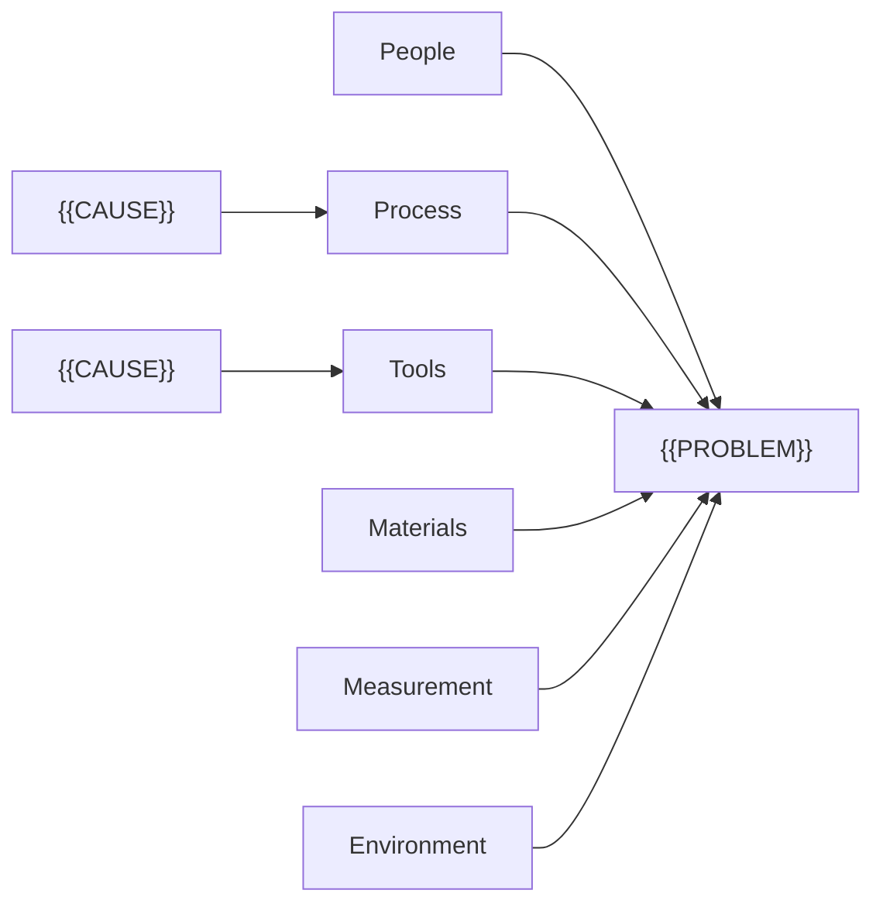

This skill turns a symptom into a problem statement, containment, a cause diagram with a text tree, two or three suspected causes with confirming evidence, and a first fix with reach, reversal and a rollback trigger.

## Adapt to your host

Hosts differ, and the same host differs by plan and by organisation. Before you
make the output, check what you can do here.

1. List the tools you can call right now, such as code execution, file creation,
   image generation or a live preview (an artifact or a canvas).
2. Take the first rung of the ladder below that your tools support. Trust your
   own tool list over any host name or table.
3. Tell the user in one line which rung you took and why. For example: "There is
   no file tool here, so the SVG is in a code block for you to save."
4. If the user names a format, use that format instead of the ladder.

### Ladder

This skill uses the diagram ladder: an SVG file or artifact, then a Mermaid block, then a text tree or table. Never use image generation for the diagram, because generated images corrupt labels and arrows. Always give the text tree as well, whatever rung you take. Templates: `references/diagrams.md`.

## Steps

Run the steps in order. Ask one question at a time and wait for the answer. If the input may be sensitive, say once: "Use only a tool your organisation has approved for this information." Containment (step 2) and the rollback trigger (step 6) are never skipped, even after "just give me the fix": they are what stops a wrong fix doing more harm. If the user asks to skip them, keep them to one or two lines each.

1. **State the problem.** Restate the symptom as a problem statement: what, where, when, how much, and what it is not (where it could happen but does not). Describe events and actions, never people: "the run was started twice", not a name. Mark each gap "[to confirm]". Ask one question for the most important gap, and name no cause until the user answers. Method: `references/method.md`.
2. **Contain the harm.** Say what stops or limits the harm now, before any cause is known: a hold, a manual check, a rollback, a notice to the people affected. If the harm has stopped, write "No containment needed:" and the reason. Ask one question: what is in place now, or can the user do the proposed containment today.
3. **Pick the tool.** Use Pareto when the user has counts by category, fishbone when several causes may combine, and 5 Whys for one chain. Pareto first, then fishbone or 5 Whys on the top category. Tell the user in one line which tool and why. Do not ask.
4. **Run it.** Build the chain or the diagram from the user's facts. Mark each link as "known" (the user said it) or "to check". A 5 Whys chain stops at a cause the team can act on in a process, a tool, a rule or a check. It never stops at a person: when an answer is "someone did X", the next why asks what let X happen or made X likely. Fishbone categories: people, process, tools, materials, measurement, environment. The people branch holds conditions such as training, workload or handover, never a named person.
5. **Name the suspected causes.** Give two or three. For each, give the evidence that would confirm it and the evidence that would rule it out. A cause stays "suspected" until that evidence is in, even when the timing fits.
6. **Choose the first fix.** Pick the smallest fix that acts on the top suspected cause. Give its reach (what and who it changes), how to reverse it, and the result, with a number and a time where you can, that shows it worked or triggers a rollback.

## The take-away

Deliver the parts in this order, using the template in `references/take-away.md`:

- The problem statement, with what it is not.
- Containment, or "No containment needed:" and the reason.
- The tool used and why, in one line.
- The diagram at the rung you took, and the text tree or table.
- Two or three suspected causes, each with confirming and ruling-out evidence.
- The first fix: the change, its reach, how to reverse it, and the rollback trigger.

If you cannot browse or open files, say so in one line. Any fact from memory is labelled RECALLED. Never invent a study, statistic, source, owner or date. Every action, in containment, the fix and the next moves, is done by "you" or a role the user named, never a role you made up. In the diagram and text tree, mark a link "[known]" only when the user stated it; anything you inferred is "[to check]".

## Next

Your next three moves. Each has an owner, a first action this week and an observable result. The owner is "you" or a role the user named. Never invent a person, a date or a source.

1. Put the containment in place, or confirm it is in place, and record that it holds.
2. Collect the evidence for the top suspected cause and record whether it confirms or rules it out.
3. If step 2 confirmed the cause, make the first fix at its stated reach and watch the rollback trigger for the stated period. If step 2 ruled it out, re-rank the remaining suspected causes, pick the fix for the new top cause, and repeat from step 2.

To check the reasoning for hidden assumptions, the user may also like a skill for finding blind spots, if they have one. Do not run it for them.

## Self-check before you deliver

- The problem statement has what, where, when, how much and what it is not, with gaps marked "[to confirm]".
- Containment comes before the causes, or "No containment needed:" gives the reason.
- No chain stops at a person, and no person is named as a cause or as the target of the fix.
- Each suspected cause has confirming and ruling-out evidence, and none is called proven without it.
- The first fix has its reach, how to reverse it and a rollback trigger.
- The text tree or table is present, and no image generation was used for the diagram.
- No source, statistic, owner or date was invented, and memory is labelled RECALLED.
- Every doer in containment, the fix and the next moves is "you" or a role the user named, and every time or amount you estimated is marked "[to confirm]".

## Read this when

| File | When |
|---|---|
| `references/method.md` | Writing the problem statement, containment, choosing and running the tool, or writing the first fix |
| `references/diagrams.md` | Drawing the fishbone, 5 Whys chain or Pareto table at any rung of the ladder |
| `references/take-away.md` | Writing the final output, or checking a worked example |

Sources for the libraries in this skill: SOURCES.md. Open it only if the user asks where an entry comes from.

## Reference: diagrams.md

# Diagrams

Use the diagram ladder: SVG, then Mermaid, then a text tree or table. Never use image
generation. Always give the text tree or table as well.

Rules for every rung:

- Keep labels short (under about six words) and exactly as in the analysis.
- Insert user text as text. In SVG, escape `&`, `<`, `>` and `"`. In Mermaid, put each label
  in double quotes and replace any `"` inside it with `'`.
- No external requests, no remote fonts, no `<script>`, no event-handler attributes.
- Mark a link "[known]" only when the user stated it. Anything you inferred is "[to check]".
- Label the last link "Root cause" only when every why above it is marked "[known]". If any
  why in the chain is still "[to check]", label the last link "Suspected root cause" instead,
  so the diagram never claims a cause as confirmed before its evidence is in.

## Text tree (always)

5 Whys chain, every link confirmed:

```text
Problem: {{PROBLEM}}
└─ Why? {{ANSWER_1}} [known]
   └─ Why? {{ANSWER_2}} [known]
      └─ Why? {{ANSWER_3}} [known]
         └─ Root cause (acts on process): {{ROOT_CAUSE}}
```

5 Whys chain, a link still unconfirmed:

```text
Problem: {{PROBLEM}}
└─ Why? {{ANSWER_1}} [known]
   └─ Why? {{ANSWER_2}} [known]
      └─ Why? {{ANSWER_3}} [to check]
         └─ Suspected root cause (acts on process): {{ROOT_CAUSE}}
```

Fishbone:

```text
Problem: {{PROBLEM}}
├─ People: {{CAUSE}}; {{CAUSE}}
├─ Process: {{CAUSE}} (suspected)
├─ Tools: {{CAUSE}}
├─ Materials: {{CAUSE}}
├─ Measurement: {{CAUSE}}
└─ Environment: {{CAUSE}}
```

Pareto table (S4):

```text
| Category | Count | Share | Cumulative |
|---|---|---|---|
| {{CATEGORY}} | {{N}} | {{P}}% | {{C}}% |
| Other | {{N}} | {{P}}% | 100% |
```

## Mermaid (S8)

5 Whys chain (use "Root cause" only if every why is confirmed, otherwise "Suspected root cause"):



Fishbone (as a left-to-right tree; drop empty branches):



## SVG (fishbone)

Copy the frame, keep the spine and six branches, and add one `<text>` per cause beside its
branch. Drop a branch with no causes. Mark a suspected cause with `font-weight="bold"`.

```svg
<svg xmlns="http://www.w3.org/2000/svg" viewBox="0 0 900 420" font-family="sans-serif" font-size="14">
  <rect width="900" height="420" fill="#ffffff"/>
  <line x1="40" y1="210" x2="700" y2="210" stroke="#222" stroke-width="3"/>
  <rect x="700" y="180" width="180" height="60" fill="#f2f2f2" stroke="#222"/>
  <text x="790" y="215" text-anchor="middle">{{PROBLEM}}</text>
  <line x1="160" y1="60" x2="240" y2="210" stroke="#222"/>
  <line x1="380" y1="60" x2="460" y2="210" stroke="#222"/>
  <line x1="600" y1="60" x2="680" y2="210" stroke="#222"/>
  <line x1="160" y1="360" x2="240" y2="210" stroke="#222"/>
  <line x1="380" y1="360" x2="460" y2="210" stroke="#222"/>
  <line x1="600" y1="360" x2="680" y2="210" stroke="#222"/>
  <text x="160" y="50" text-anchor="middle" font-weight="bold">People</text>
  <text x="380" y="50" text-anchor="middle" font-weight="bold">Process</text>
  <text x="600" y="50" text-anchor="middle" font-weight="bold">Tools</text>
  <text x="160" y="385" text-anchor="middle" font-weight="bold">Materials</text>
  <text x="380" y="385" text-anchor="middle" font-weight="bold">Measurement</text>
  <text x="600" y="385" text-anchor="middle" font-weight="bold">Environment</text>
  <text x="200" y="120">{{CAUSE}}</text>
</svg>
```

For a 5 Whys chain or a Pareto chart as SVG, use boxes joined by arrows, or bars sorted
largest first with the cumulative share as text above each bar.

## Reference: method.md

# Method

## Problem statement

Write one short paragraph, then the is and is-not lines. An "is / is not" comparison is a
common problem-definition tool (S5).

| Question | Is | Is not (where it could happen but does not) |
|---|---|---|
| What | the defect or event, in observable terms | similar things that are fine |
| Where | the place, system, product line or team | places that are fine |
| When | first seen, how often, the pattern | times that are fine |
| How much | count, cost, people affected | |

- Describe events and actions, never people. "The run was started twice", not a name.
- The is-not column is where the clues are: what differs between the "is" and the "is not"
  cases often points at the cause.
- Mark each gap "[to confirm]". Never fill a gap with a guess.

## Containment

Containment limits the harm while the cause is still unknown. It is not the fix (S5).

- Ask: who or what is still being harmed, and what stops that today?
- Typical moves: hold or pause the process, add a manual check, roll back the last change,
  quarantine the affected items, tell the people affected.
- Give each containment an end: it stays until the first fix has passed its rollback trigger
  period.
- If the harm has stopped and cannot recur before the fix, write "No containment needed:"
  and the reason. Never leave the step out.

## Choosing the tool

| Situation | Tool | Why |
|---|---|---|
| Counts or costs by category exist | Pareto | Sorting shows the few categories that carry most of the total (S4) |
| Several causes may combine | Fishbone | The categories stop the team missing a whole kind of cause (S3) |
| One failure, one likely chain | 5 Whys | Each why moves one step past the symptom (S1) |

Run Pareto first when counts exist, then a fishbone or a 5 Whys on the top one or two
categories.

## 5 Whys

- Ask why about the last answer, not about the original symptom (S2).
- Five is a guide, not a rule. Stop when the answer is a cause the team can act on in a
  process, a tool, a rule or a check. Stop earlier if the next why leaves the team's control;
  say so.
- **Never stop at a person.** When an answer is "someone did X" or "someone forgot", the
  next why asks what let X happen, or what made X likely: a missing check, a confusing screen,
  a rushed handover, no second approval. People act on the information and tools they have;
  you can fix the system, not the person (S6).
- A chain that ends at a person is also weak analysis: it stops too soon, and a different
  person would fail the same way (S2).
- Mark each link "known" or "to check". A chain built only on guesses is a hypothesis.
- If two answers are plausible at one step, branch the chain or switch to a fishbone.

## Fishbone

Put the problem at the head. Use these six branches (S3):

- **People**: training, workload, handover, staffing. Conditions, never a named person.
- **Process**: steps, rules, approvals, sequence, missing checks.
- **Tools**: software, machines, equipment, integrations.
- **Materials**: inputs, data, parts, supplier content.
- **Measurement**: how the problem or the output is checked, and how late it is seen.
- **Environment**: timing, calendar, location, load, external conditions.

Drop a branch with nothing on it rather than filling it. Circle the two or three causes the
facts point to most; these become the suspected causes.

## Pareto

- Sort categories by count or cost, largest first. Add the cumulative share (S4).
- Name the one or two categories that make up most of the total. Work on those first.
- Group "other" last, whatever its size.
- A Pareto table shows where the problem is concentrated, not why. Run a fishbone or 5 Whys
  on the top category.

## Suspected causes and evidence

For each suspected cause, write (S5):

- **Confirms it:** the observation, log, count or test that would show it is the cause.
- **Rules it out:** the observation that would show it is not.

Timing alone ("it started after the change") is a lead, not proof. A cause stays suspected
until the confirming evidence is in. A suspected cause can also be "not known yet" when the
facts do not point anywhere; say what would narrow it.

## The first fix

Choose the smallest change that acts on the top suspected cause. Prefer a change that makes
the error hard to repeat (a check, a lock, a default) over a reminder or more training.

- **Reach:** what the change touches and who it affects. Start small where you can: one team,
  one run, one site (S7).
- **Reversal:** exactly how to undo it, and how long that takes. Mark the time "[to confirm]" unless the user gave it.
- **Rollback trigger:** the result that shows it failed, with a number and a period where you
  can, such as "any duplicate payment in the next two runs" or "error rate above 2% in the
  first hour". If it fires, reverse the fix and keep the containment (S7).
- **Worked result:** the result that shows it worked, over the same period.

## Reference: take-away.md

# Take-away template

Use one line or block per element. Keep every heading.

```text
Problem statement
{{One paragraph: what, where, when, how much.}}
Is not: {{where it could happen but does not}}
Gaps: {{each "[to confirm]" item, or "none"}}

Containment (now, before the cause is known)
{{The action, who does it (you or a named role), and when it ends}}
or: No containment needed: {{reason}}

Tool: {{Pareto / fishbone / 5 Whys}}, because {{one line}}

Diagram ({{rung taken}}, because {{one line}})
{{SVG, Mermaid block, or nothing extra at the text rung}}

Text tree
{{text tree or Pareto table from references/diagrams.md}}

Suspected causes
1. {{cause}}. Confirms it: {{evidence}}. Rules it out: {{evidence}}.
2. {{cause}}. Confirms it: {{evidence}}. Rules it out: {{evidence}}.
3. {{optional}}

First fix
Change: {{the smallest change that acts on cause 1}}
Reach: {{what and who it touches}}
Reversal: {{how to undo it, and how long it takes, marked [to confirm] unless the user said}}
Worked if: {{result, number, period}}
Rollback if: {{result, number, period}}. Then reverse the fix and keep the containment.

Your next three moves
1. {{owner}}: {{first action this week}}. Result: {{observable result}}.
2. ...
3. ...
```

## Worked example (short)

A warehouse shipped 14 orders to old addresses last week. The user said labels print from the
overnight order export and named a dispatch lead.

```text
Problem statement
14 orders last week went to a customer's previous address. All were repeat customers who
had changed address in their account within 48 hours of ordering.
Is not: new customers; customers who changed address more than 48 hours before ordering.
Gaps: whether it happened before last week [to confirm]

Containment (now, before the cause is known)
The dispatch lead holds any order where the address changed in the last 48 hours and checks
it by hand. Ends when the first fix passes its rollback period.

Tool: 5 Whys, because the is / is-not pattern points to one chain.

Text tree
Problem: orders sent to old addresses
└─ Why? Labels printed from the overnight order export [known]
   └─ Why? The export reads the address cached at the last nightly sync [to check]
      └─ Suspected root cause (acts on process): address changes reach dispatch only after a nightly sync

Suspected causes
1. The export uses a nightly cached address. Confirms it: all 14 changes fall after the last
   sync before dispatch. Rules it out: any of the 14 changed before that sync.
2. The account page saves the new address only to billing. Confirms it: the database shows
   the old delivery address after a test change. Rules it out: the test change updates both.

First fix
Change: the export reads the live delivery address at print time.
Reach: label printing at one warehouse for one week.
Reversal: switch the export setting back; about ten minutes [to confirm].
Worked if: zero wrong-address orders in one week, from at least 5 recent address changes.
Rollback if: any wrong-address order, or label printing slower than 2 seconds a label.
```

## Sources

# Sources

All entries retrieved 29 September 2026.

[S1] Lean Enterprise Institute. (n.d.). 5 Whys. In *Lean lexicon*. Retrieved September 29, 2026, from https://www.lean.org/lexicon-terms/5-whys/

[S2] Five whys. (n.d.). In *Wikipedia*. Retrieved September 29, 2026, from https://en.wikipedia.org/wiki/Five_whys

[S3] Ishikawa diagram. (n.d.). In *Wikipedia*. Retrieved September 29, 2026, from https://en.wikipedia.org/wiki/Ishikawa_diagram

[S4] Pareto chart. (n.d.). In *Wikipedia*. Retrieved September 29, 2026, from https://en.wikipedia.org/wiki/Pareto_chart

[S5] Eight disciplines problem solving. (n.d.). In *Wikipedia*. Retrieved September 29, 2026, from https://en.wikipedia.org/wiki/Eight_disciplines_problem_solving

[S6] Lunney, J., & Lueder, S. (2016). Postmortem culture: Learning from failure. In B. Beyer, C. Jones, J. Petoff, & N. R. Murphy (Eds.), *Site reliability engineering: How Google runs production systems*. O'Reilly Media. Retrieved September 29, 2026, from https://sre.google/sre-book/postmortem-culture/

[S7] Warner, A., & Davidovič, Š. (2018). Canarying releases. In B. Beyer, N. R. Murphy, D. K. Rensin, K. Kawahara, & S. Thorne (Eds.), *The site reliability workbook: Practical ways to implement SRE*. O'Reilly Media. Retrieved September 29, 2026, from https://sre.google/workbook/canarying-releases/

[S8] Mermaid. (n.d.). Flowcharts syntax. In *Mermaid documentation*. Retrieved September 29, 2026, from https://mermaid.js.org/syntax/flowchart.html
