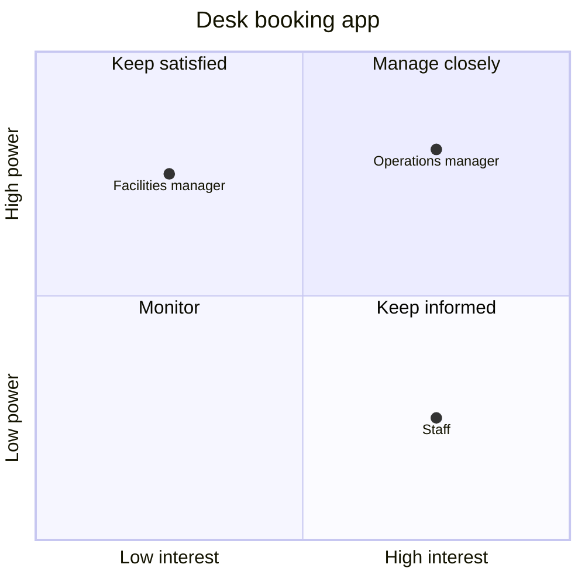

This skill builds a power and interest grid for a change, with what each stakeholder cares about and one message for each, as a diagram and a text table.

## Adapt to your host

Hosts differ, and the same host differs by plan and by organisation. Before you
make the output, check what you can do here.

1. List the tools you can call right now, such as code execution, file creation,
   image generation or a live preview (an artifact or a canvas).
2. Take the first rung of the ladder below that your tools support. Trust your
   own tool list over any host name or table.
3. Tell the user in one line which rung you took and why. For example: "There is
   no file tool here, so the SVG is in a code block for you to save."
4. If the user names a format, use that format instead of the ladder.

### Ladder

This skill uses the diagram ladder: an SVG file or artifact, then a Mermaid quadrant chart, then a text grid. Never use image generation for the grid, because generated images corrupt labels and positions. Always give the text table as well, whatever rung you take. Templates: `references/diagrams.md`.

## Steps

In the first reply, say once: "Power and interest ratings about named people are sensitive. Share this map only with the people who need it, and use only a tool your organisation has approved for this information." Then run the steps in order. Ask one question at a time and wait for the answer.

If the user asks to skip the questions, build the whole take-away in one pass from what they gave: every rating is "suggested", every unknown is `[to confirm]`, and the warning stays. Then offer to confirm the ratings.

1. **Name the change.** Ask one question: what change or decision is the map for, and who decides.
2. **List the stakeholders.** Ask one question: who is affected, who decides, and who could block it. Accept names, roles or groups. Keep each as the user wrote it. Never assume a stakeholder's gender from a name or a role: refer to each by name or role, or use "they", unless the user used a pronoun for that person.
3. **Rate power and interest.** For each stakeholder, suggest high or low power and high or low interest, with a one-line reason from what the user said (S1). Ask the user to confirm or correct them in one reply. A rating the user gives or confirms is marked "you". Every other rating stays "suggested", including after "your call" or "I don't know". Never mark a suggested rating as confirmed.
4. **Find what each cares about.** Ask one question: what does each stakeholder care about most in this change? What the user says is used as given. An unknown concern is `[to confirm]`, with a question the user could ask that person. Do not guess a concern and state it as fact.
5. **Write one message each.** One or two sentences per stakeholder, aimed at what they care about and fitted to their quadrant (S2). Use `references/method.md`. When the concern is `[to confirm]`, write the message from the change itself and mark it "[depends on: concern to confirm]".
6. **Draw the grid.** Place each stakeholder on the grid at the best rung of the ladder, and give the text table. Say in one line which rung you took.

If the user plans to share the map widely, say that ratings of named people should stay with the people who need them, and offer a version safe to share: the messages and the plan without the ratings. A role-only version (roles without names, ratings kept) is safe only when each role is held by several people; when a role is unique in the organisation (a CIO, a named director's title), say the rating still identifies that person, and offer to drop the ratings instead. See `references/method.md`.

## The take-away

Deliver these parts in this order, using the template in `references/take-away.md`:

- The sensitivity warning, in one line.
- The change and who decides.
- The text table: stakeholder, power, interest, rated by ("you" or "suggested"), quadrant, what they care about, message.
- The diagram at the rung you took.
- What you do not know yet: every `[to confirm]` item and every suggested rating.

If you cannot browse or open files, say so in one line. Any fact from memory is labelled RECALLED. Never invent a concern, a rating source, an owner or a date.

## Next

Your next three moves. Each has an owner, a first action this week and an observable result. The owner is "you" or a role the user named. Never invent a person or a date.

1. Check each suggested rating and `[to confirm]` concern with someone who knows that stakeholder. If there are none, show the map to one such person and note any change.
2. Send or say the message to the stakeholder with the most power over the change, and note their reply.
3. Set how often each quadrant hears from you, and put the first update in the calendar.

If you need to prepare a hard conversation with one of these people, the user may also like a skill for that, if they have one. Do not run it for them.

## Self-check before you deliver

- The sensitivity warning is in the first reply and in the take-away.
- Each reply before the take-away asked at most one question, unless the user asked to skip them.
- Every rating says "you" or "suggested", and no suggested rating is called confirmed.
- No concern is stated as fact unless the user gave it; unknowns are `[to confirm]`.
- No reply calls a stakeholder "he" or "she" unless the user did; each is named, given a role, or "they".
- Every stakeholder has one message, and a message that rests on an unknown concern is marked.
- The text table is present, the diagram rung is named, and no image generation was used.
- The three next moves have an owner, a first action this week and an observable result, with no invented person or date.

## Read this when

| File | When |
|---|---|
| `references/method.md` | Rating power and interest, choosing the quadrant strategy, writing messages, or sharing the map |
| `references/diagrams.md` | Drawing the grid at any rung of the ladder |
| `references/take-away.md` | Writing the final output, or checking the worked example |

Sources for the libraries in this skill: SOURCES.md. Open it only if the user asks where an entry comes from.

## Reference: diagrams.md

# Diagrams

Use the diagram ladder: SVG, then a Mermaid quadrant chart, then a text grid. Never use image
generation. Always give the text table as well (see `references/take-away.md`).

Rules for every rung:

- Power is the vertical axis (high at the top). Interest is the horizontal axis (high at the
  right).
- Quadrants: top right "Manage closely", top left "Keep satisfied", bottom right "Keep
  informed", bottom left "Monitor" (S1).
- Labels are the stakeholder names or roles exactly as in the table, short. Add " (s)" to a
  label whose ratings are suggested.
- Insert user text as text. In SVG, escape `&`, `<`, `>` and `"`. In Mermaid, remove `:`,
  `[`, `]` and `"` from a point label.
- No external requests, no remote fonts, no `<script>`, no event-handler attributes.

## Text grid (last rung)

```text
                 Low interest            High interest
High power   | Keep satisfied:        | Manage closely:        |
             | {{NAME}}               | {{NAME}}               |
Low power    | Monitor:               | Keep informed:         |
             | {{NAME}}               | {{NAME}}               |
```

## Mermaid quadrant chart (S3)

Place high at about 0.75 and low at about 0.25. Spread points in the same quadrant by 0.05
to 0.1 so labels do not overlap.

```mermaid
quadrantChart
  title {{CHANGE}}
  x-axis Low interest --> High interest
  y-axis Low power --> High power
  quadrant-1 Manage closely
  quadrant-2 Keep satisfied
  quadrant-3 Monitor
  quadrant-4 Keep informed
  {{NAME}}: [0.75, 0.80]
  {{NAME}}: [0.25, 0.75]
```

## SVG (first rung)

Copy the frame and add one `<circle>` and one `<text>` per stakeholder. High sits at about
three quarters of a quadrant's span, low at about one quarter.

```svg
<svg xmlns="http://www.w3.org/2000/svg" viewBox="0 0 640 560" font-family="sans-serif" font-size="14">
  <rect width="640" height="560" fill="#ffffff"/>
  <text x="340" y="28" text-anchor="middle" font-weight="bold">{{CHANGE}}</text>
  <rect x="60" y="40" width="280" height="240" fill="#fdf1e6" stroke="#222"/>
  <rect x="340" y="40" width="280" height="240" fill="#fbe0e0" stroke="#222"/>
  <rect x="60" y="280" width="280" height="240" fill="#f2f2f2" stroke="#222"/>
  <rect x="340" y="280" width="280" height="240" fill="#e6f0fb" stroke="#222"/>
  <text x="70" y="60" font-weight="bold">Keep satisfied</text>
  <text x="350" y="60" font-weight="bold">Manage closely</text>
  <text x="70" y="300" font-weight="bold">Monitor</text>
  <text x="350" y="300" font-weight="bold">Keep informed</text>
  <text x="340" y="548" text-anchor="middle">Interest: low to high</text>
  <text x="20" y="280" text-anchor="middle" transform="rotate(-90 20 280)">Power: low to high</text>
  <circle cx="480" cy="100" r="6" fill="#222"/>
  <text x="492" y="105">{{NAME}}</text>
</svg>
```

## Reference: method.md

# Method

Each rule carries a source id. Rules marked (skill rule) are this skill's own choice.

## Ratings

- **Power:** how much the stakeholder can change or stop the outcome: decision rights,
  budget, veto, control of people or systems the change needs (S1).
- **Interest:** how much the outcome affects them, or how closely they will follow it (S1).
- Use high or low for each. Give a one-line reason from what the user said. (skill rule)
- "Rated by" is "you" when the user gave or confirmed the rating, and "suggested" otherwise.
  Silence, "your call" and "I don't know" leave a rating "suggested". (skill rule)
- Rate the role in this change, not the person's character. Write "controls the budget",
  never "difficult" or "lazy". (skill rule)

## Quadrants and strategies

| Power | Interest | Quadrant | What they need | Source |
|---|---|---|---|---|
| High | High | Manage closely | Close work together, regular two-way contact, a say in key choices | (S1, S2) |
| High | Low | Keep satisfied | Short, periodic updates on what affects them; no detail they did not ask for | (S1, S2) |
| Low | High | Keep informed | Regular updates, a way to raise concerns, answers to those concerns | (S1, S2) |
| Low | Low | Monitor | Occasional check, general updates; watch for a change in power or interest | (S1, S2) |

A stakeholder can move quadrant as the change goes on. Map again at each major step (S1).

## Messages

- One or two sentences per stakeholder, in plain words. (skill rule)
- Start from what they care about, then say what the change means for that, then what you
  need from them, if anything. (S2)
- Fit the quadrant: a "manage closely" message asks for their input; a "keep satisfied"
  message is short and says what they need to know; a "keep informed" message says when
  they will hear next and how to raise a concern; a "monitor" message is a general update.
  (S2)
- No promise the user did not make, and no fact the user did not give. (skill rule)
- A concern still `[to confirm]` gives a message written from the change itself, marked
  "[depends on: concern to confirm]". (skill rule)

## Sharing the map

Ratings of named people can harm working relationships if the wrong person reads them.
(skill rule)

- Keep the full map with the people who plan the engagement, such as the change lead and
  the sponsor.
- For a wider audience, offer one of these versions: the messages and the update plan
  without the ratings, or the grid with roles or groups in place of names.
- If the user still wants to share the full map, say the risk once and do not repeat it.

## Reference: take-away.md

# Take-away template

Fill every line. Keep the order. In a table cell, escape any `|` in the user's own text as
`\|` and replace a line break with a space or `<br>`, so the table still renders.

```md
Power and interest ratings about named people are sensitive. Share this map only with the people who need it.

**Change:** [the change or decision]. **Decides:** [who decides, or [to confirm]].

| Stakeholder | Power | Interest | Rated by | Quadrant | Cares about | Message |
|---|---|---|---|---|---|---|
| [name, role or group as the user wrote it] | [high or low] | [high or low] | [you, or suggested: one-line reason] | [Manage closely, Keep satisfied, Keep informed or Monitor] | [what the user said, or [to confirm]: question to ask them] | "[one or two sentences]" [plus "[depends on: concern to confirm]" when the concern is unknown] |

[One line naming the diagram rung and why.]

[The diagram at that rung.]

**What you do not know yet:** [each [to confirm] item and each suggested rating, or "Nothing: you confirmed every rating and concern."]
```

## Worked example (short)

A team lead maps a change to the office booking system. The user confirmed every rating and
gave every concern except the facilities manager's.

Power and interest ratings about named people are sensitive. Share this map only with the
people who need it.

**Change:** move desk booking to the new app by the end of the quarter. **Decides:** the
operations manager.

| Stakeholder | Power | Interest | Rated by | Quadrant | Cares about | Message |
|---|---|---|---|---|---|---|
| Operations manager | high | high | you | Manage closely | Fewer empty desks | "Desk booking moves to the new app by the end of the quarter, to cut empty desks." |
| Facilities manager | high | low | you | Keep satisfied | [to confirm]: "What would make this change easy for your team?" | "The app goes live at the end of the quarter." [depends on: concern to confirm] |
| Staff | low | high | you | Keep informed | Getting a desk near their team | "Desk booking moves to the new app by the end of the quarter, so you can book a desk near your team." |

There is no file tool here, so the grid is a Mermaid block.



**What you do not know yet:** what the facilities manager cares about.

## Sources

# Sources

All entries retrieved 29 September 2026.

[S1] Stakeholder analysis. (n.d.). In *Wikipedia*. Retrieved September 29, 2026, from https://en.wikipedia.org/wiki/Stakeholder_analysis

[S2] Martins, J. (2026, April 15). *Project stakeholder: Definition, analysis & mapping*. Asana. Retrieved September 29, 2026, from https://asana.com/resources/project-stakeholder

[S3] Mermaid. (n.d.). Quadrant chart. In *Mermaid documentation*. Retrieved September 29, 2026, from https://mermaid.js.org/syntax/quadrantChart.html
