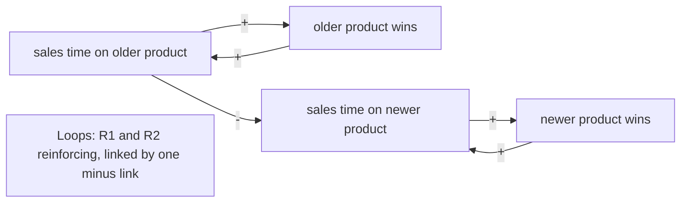

This skill maps the causal loops behind a recurring problem, names the system archetype that fits, and suggests one leverage point to test, as text notation and a diagram.

## Adapt to your host

Hosts differ, and the same host differs by plan and by organisation. Before you
make the output, check what you can do here.

1. List the tools you can call right now, such as code execution, file creation,
   image generation or a live preview (an artifact or a canvas).
2. Take the first rung of the ladder below that your tools support. Trust your
   own tool list over any host name or table.
3. Tell the user in one line which rung you took and why. For example: "There is
   no file tool here, so the SVG is in a code block for you to save."
4. If the user names a format, use that format instead of the ladder.

### Ladder

This skill uses the diagram ladder: an SVG file or artifact, then a Mermaid flowchart, then the text notation alone. Never use image generation for a causal loop, even when the user asks for it: generated images corrupt labels, arrows and polarity signs. Say so in one line and offer the SVG instead. Always give the text notation as well, whatever rung you take. Templates: `references/diagrams.md`.

## Steps

Say once, in the first reply: "Use only a tool your organisation has approved for this information." Then run the steps in order. Ask one question at a time and wait for the answer.

If the user asks to skip the questions, build the whole take-away in one pass from what they gave: a link the user stated is "you", every link you add is "suggested", every unknown is `[to confirm]`, the archetype is "suggested", and the leverage point is a hypothesis. Then offer to confirm the links.

1. **Describe the pattern.** Ask one question: what keeps happening, how has it changed over time, and what has been tried? A systems map explains a pattern over time, not a single event (S2). If the user describes a one-off failure, say a root-cause method fits better, and carry on only if they want the map.
2. **List the variables.** Suggest four to eight variables from what the user said. Each is a noun phrase that can go up or down ("backlog size", not "the backlog problem") (S2). Ask the user to confirm or correct the list in one reply. Keep every variable the user adds.
3. **Link them.** Suggest each causal link with a polarity and a one-line reason, and ask the user to confirm or correct them in one reply. `+` means both move the same way; `-` means they move opposite ways; `||` marks a delay (S2). A link the user gives or confirms is marked "you". Every other link stays "suggested", including after "your call". A link whose direction nobody knows gets polarity `?` and `[to confirm]`: never guess a sign and state it as fact.
4. **Find the loops.** Trace each closed loop. Count its `-` links: an even count (zero included) makes it R, reinforcing; an odd count makes it B, balancing (S2). A loop with any `?` link is "type unknown until [link] is confirmed". Number them R1, B1 and so on.
5. **Name the archetype.** Compare the loops with `references/archetypes.md`. Suggest the one or two that fit best, each with the evidence from the user's own words, and ask one question: which fits? The user may pick one, pick none, or say "your call". Record the archetype as "confirmed by you", "suggested" or "no standard archetype fits". A map with no archetype is still a complete map.
6. **Find the leverage point.** Suggest one leverage point from the archetype's usual leverage, or from the loops when no archetype fits. Name its level on Meadows' list in `references/archetypes.md` (S3). Ask one question: can you act on this, or who can? Fit the point to what the user can change. The leverage point is always a hypothesis, with a small test that would show whether it works. Never call it proven. The test's duration, sample size and frequency are `[to confirm]` unless the user gave them.
7. **Draw the map.** Write the text notation, then draw the diagram at the best rung of the ladder. Say in one line which rung you took.

## The take-away

Deliver these parts in this order, using the template in `references/take-away.md`:

- The pattern over time, in the user's words and numbers.
- The links table: from, to, polarity, delay, rated by ("you" or "suggested").
- The loops: each with its number, type (R, B or unknown) and a one-line story.
- The causal loop in text notation, then the diagram at the rung you took.
- The archetype, with its status and the evidence it rests on.
- The leverage point: what it is, its level on Meadows' list, why, and the small test. Labelled a hypothesis.
- What you do not know yet: every `[to confirm]` item, every `?` link and every suggested link.

If you cannot browse or open files, say so in one line. Any fact from memory is labelled RECALLED. Never invent a number, an owner, a date or a source.

## Next

Your next three moves. Each has an owner, a first action this week and an observable result. The owner is "you" or a role the user named. Never invent a person or a date.

1. Check the suggested links and every `?` link with someone who works inside the system, and note any change.
2. Run the small test of the leverage point, and write down what you expect to see before you start.
3. Pick the one variable that shows whether the pattern is changing, and start recording it on a regular day.

If the problem is a single failure rather than a pattern, the user may also like a skill for root-cause analysis, if they have one. Do not run it for them.

## Self-check before you deliver

- Each reply before the take-away asked at most one question, unless the user asked to skip them.
- Every link has a polarity (`+`, `-` or `?`) and says "you" or "suggested"; no suggested link is called confirmed.
- Every loop type follows the count of `-` links, and a loop with a `?` link is typed unknown.
- The archetype status is one of "confirmed by you", "suggested" or "no standard archetype fits", with evidence from the user's words.
- The leverage point names its level on Meadows' list, is labelled a hypothesis and has a small test.
- The text notation is present, the diagram rung is named, and no image generation was used.
- No number, owner, date or source is invented; the three next moves have an owner, a first action this week and an observable result.

## Read this when

| File | When |
|---|---|
| `references/archetypes.md` | Naming the archetype, or choosing a leverage point and its level on Meadows' list |
| `references/diagrams.md` | Writing the text notation, or drawing the loop as Mermaid or SVG |
| `references/take-away.md` | Writing the final output, or checking the worked example |

Sources for the libraries in this skill: SOURCES.md. Open it only if the user asks where an entry comes from.

## Reference: archetypes.md

# System archetypes and leverage points

An archetype is a common loop structure that produces a familiar pattern over time (S1).
Match on structure and behaviour over time, not on the topic. Suggest at most two, each with
the evidence from the user's words. If none fits, say "no standard archetype fits" (skill rule).

Each entry: the signs to listen for, the core loops in text notation, and the usual leverage.

## 1. Balancing process with delay (S1)

- **Signs:** people overshoot or undershoot a target; they push harder because the result has
  not shown yet; the numbers swing.
- **Loops:** `B1: action -(+)-> result || ; result -(-)-> gap to goal ; gap to goal -(+)-> action`
- **Leverage:** be patient with the delay, or shorten it; act in smaller steps.

## 2. Limits to growth (S1)

- **Signs:** growth, then a flat line or a fall, while the same effort continues or grows.
- **Loops:** `R1: effort -(+)-> performance -(+)-> effort`; `B1: performance -(+)-> strain on
  a limit -(-)-> performance`
- **Leverage:** find and ease the limit; do not push the growth loop harder. A variant with two
  or more limits is called the attractiveness principle (S1).

## 3. Shifting the burden (S1)

- **Signs:** a quick fix eases the symptom each time; the real fix is slow or hard and keeps
  being put off; people come to depend on the quick fix.
- **Loops:** `B1: symptom -(+)-> quick fix -(-)-> symptom`; `B2: symptom -(+)-> real fix || -(-)->
  symptom`; side effect `quick fix -(-)-> ability to do the real fix`
- **Leverage:** keep the quick fix only as a bridge; invest in the real fix and in the
  capability it needs.

## 4. Shifting the burden to the intervenor (S1)

- **Signs:** an outside helper (a consultant, another team, a vendor) solves the problem each
  time, and the people inside grow less able to solve it themselves.
- **Loops:** as archetype 3, with `helper handles it -(-)-> inside capability`
- **Leverage:** make the helper teach while they help, and plan the hand-back.

## 5. Eroding goals (S1)

- **Signs:** the target keeps being lowered to match what is achieved; "good enough" drifts
  down.
- **Loops:** `B1: gap to goal -(+)-> pressure to lower goal -(+)-> goal lowered -(-)-> gap to
  goal`; `B2: gap to goal -(+)-> corrective action || -(-)-> gap to goal`
- **Leverage:** hold the goal steady and tie it to an outside standard; fund the corrective
  action.

## 6. Escalation (S1)

- **Signs:** two parties each respond to the other's move to protect themselves; each round is
  bigger.
- **Loops:** `R1: A's actions -(+)-> threat to B -(+)-> B's actions -(+)-> threat to A -(+)->
  A's actions`. Each side sees only its own balancing loop; together they reinforce.
- **Leverage:** one side stops reacting, or both agree a shared goal; turn the contest into
  cooperation.

## 7. Success to the successful (S1)

- **Signs:** two people, teams or products share a limited resource; the one that starts
  ahead gets more, and the other falls further behind.
- **Loops:** `R1: resources to A -(+)-> success of A -(+)-> resources to A`; `R2: resources to
  B -(+)-> success of B -(+)-> resources to B`; linked by `resources to A -(-)-> resources to B`
- **Leverage:** decouple the two, or allocate on a goal for the whole system rather than on
  past success.

## 8. Tragedy of the commons (S1)

- **Signs:** each party gains by using a shared resource; total use grows; the gain per party
  falls, and the resource degrades.
- **Loops:** `R1 (per party): activity -(+)-> own gain -(+)-> activity`; `B1: total activity
  -(-)-> resource available || -(+)-> gain per activity -(+)-> activity -(+)-> total activity`
- **Leverage:** make the shared limit visible and agree a rule or quota for its use.

## 9. Fixes that fail (S1)

- **Signs:** a fix works at once, the problem returns later, often worse, and the same fix is
  applied again.
- **Loops:** `B1: problem -(+)-> fix -(-)-> problem`; `R1: fix -(+)-> side effect || -(+)->
  problem`
- **Leverage:** name the delayed side effect and treat it; limit the fix, or change it so it
  does not feed the side effect.

## 10. Growth and underinvestment (S1)

- **Signs:** demand grows until capacity is overloaded; quality or service falls; demand then
  falls, which seems to show that more capacity was not needed.
- **Loops:** `R1: demand -(+)-> growth -(+)-> demand`; `B1: demand -(+)-> load on capacity
  -(-)-> quality -(+)-> demand`; `B2: load on capacity -(+)-> investment || -(+)-> capacity -(-)-> load on capacity`
- **Leverage:** invest ahead of demand, against a standard of quality that is not lowered.

## Leverage levels, from Meadows (S3, S4)

Name the level a leverage point sits at. The list runs from least to most leverage. Higher
levels are more powerful and usually harder to change (S3).

| Level | Place to intervene |
|---|---|
| 12 | Constants, parameters and numbers, such as budgets and targets |
| 11 | The size of buffers and stocks, relative to their flows |
| 10 | The structure of stocks and flows |
| 9 | The length of delays, relative to the rate of change |
| 8 | The strength of balancing (negative) feedback loops |
| 7 | The gain of reinforcing (positive) feedback loops |
| 6 | The structure of information flows: who has access to what |
| 5 | The rules of the system: incentives, punishments, constraints |
| 4 | The power to add, change or self-organise the system's structure |
| 3 | The goal of the system |
| 2 | The mindset or paradigm the system arises from |
| 1 | The power to transcend paradigms |

Fit the point to what the user can change (skill rule). A level-6 change the user can make this
month is worth more to them than a level-2 change they cannot touch.

## Reference: diagrams.md

# Diagrams

Use the diagram ladder: SVG, then a Mermaid flowchart, then the text notation alone. Never use
image generation, even when asked. Always give the text notation as well.

Rules for every rung:

- Variable names exactly as in the links table, short.
- Every arrow carries its polarity: `+`, `-` or `?`. A delay adds `||` to the arrow label.
- Each loop carries its label (R1, B1, or "?1" for type unknown) near its centre.
- Mark a suggested link with " (s)" on its label, so the reader sees what is not confirmed.
- Insert user text as text. In SVG, escape `&`, `<`, `>` and `"`. In Mermaid, remove `"`,
  `|`, `[`, `]`, `(` and `)` from a node label (skill rule).
- No external requests, no remote fonts, no `<script>`, no event-handler attributes.

## Text notation (always)

One link per line, then one line per loop (S2).

```text
Links
  [from] --(+)--> [to]
  [from] --(-)--> [to]
  [from] --(+ ||)--> [to]        delay on this link
  [from] --(?)--> [to]           polarity [to confirm]

Loops
  R1: [a] -> [b] -> [c] -> [a]   reinforcing, [n] "-" links (even)
  B1: [a] -> [d] -> [a]          balancing, [n] "-" links (odd)
  ?1: [a] -> [e] -> [a]          type unknown until [e] -> [a] is confirmed
```

## Mermaid flowchart (S5)

```mermaid
flowchart LR
  A[{{VARIABLE_A}}] -->|+| B[{{VARIABLE_B}}]
  B -->|- delay| C[{{VARIABLE_C}}]
  C -->|+| A
  K[Loops: B1 balancing, one minus link]
```

## SVG (first rung)

Place the variables on a circle, one `<text>` each, and join them with curved paths that end
in the arrow marker. Put the polarity sign near each arrow head and the loop label in the
middle. Copy the frame and add one `<path>` and one sign per link.

```svg
<svg xmlns="http://www.w3.org/2000/svg" viewBox="0 0 640 480" font-family="sans-serif" font-size="14">
  <defs>
    <marker id="arrow" viewBox="0 0 10 10" refX="9" refY="5" markerWidth="8" markerHeight="8" orient="auto-start-reverse">
      <path d="M0,0 L10,5 L0,10 z" fill="#222"/>
    </marker>
  </defs>
  <rect width="640" height="480" fill="#ffffff"/>
  <text x="320" y="28" text-anchor="middle" font-weight="bold">{{TITLE}}</text>
  <text x="320" y="90" text-anchor="middle">{{VARIABLE_A}}</text>
  <text x="500" y="260" text-anchor="middle">{{VARIABLE_B}}</text>
  <text x="140" y="260" text-anchor="middle">{{VARIABLE_C}}</text>
  <path d="M360,100 Q480,140 495,240" fill="none" stroke="#222" marker-end="url(#arrow)"/>
  <text x="470" y="170">+</text>
  <path d="M470,270 Q320,340 170,270" fill="none" stroke="#222" marker-end="url(#arrow)"/>
  <text x="320" y="330" text-anchor="middle">- ||</text>
  <path d="M145,240 Q160,140 280,100" fill="none" stroke="#222" marker-end="url(#arrow)"/>
  <text x="170" y="170">+</text>
  <text x="320" y="200" text-anchor="middle" font-weight="bold">B1</text>
</svg>
```

## Reference: take-away.md

# Take-away template

Fill every line. Keep the order. In a table cell, escape any `|` in the user's own text as
`\|` and replace a line break with a space or `<br>`, so the table still renders.

```md
**Pattern over time:** [what keeps happening, over what period, and what has been tried, in the user's words and numbers].

| From | To | Polarity | Delay | Rated by |
|---|---|---|---|---|
| [variable] | [variable] | [+, - or ? [to confirm]] | [yes or no] | [you, or suggested: one-line reason] |

**Loops**

- [R1, B1, or ?1]: [variable] -> [variable] -> [variable]. [Reinforcing, balancing, or type unknown until [link] is confirmed]. [One-line story of what the loop does.]

[The causal loop in text notation, from references/diagrams.md.]

[One line naming the diagram rung and why.]

[The diagram at that rung.]

**Archetype:** [name, confirmed by you | name, suggested | no standard archetype fits]. Evidence: [the user's words that match its signs, or, when none fits, why the nearest one does not].

**Leverage point (hypothesis):** [what to change]. Level [n] on Meadows' list: [place to intervene]. Why: [which loop it weakens or strengthens]. Small test: [what to try, for how long, and what result would show it works; any duration, sample size or frequency the user did not give is `[to confirm]`].

**What you do not know yet:** [each ? link, each suggested link and each [to confirm] item, or "Nothing: you confirmed every link."]
```

## Worked example (short)

A sales director sees two product lines share one sales team. The user confirmed every link
and picked the archetype. The leverage point is still a hypothesis.

**Pattern over time:** over the last four quarters, the older product's sales rose each
quarter and the newer product's fell, while both kept the same targets. Nothing has been tried
yet.

| From | To | Polarity | Delay | Rated by |
|---|---|---|---|---|
| sales time on older product | older product wins | + | no | you |
| older product wins | sales time on older product | + | no | you |
| sales time on older product | sales time on newer product | - | no | you |
| sales time on newer product | newer product wins | + | no | you |
| newer product wins | sales time on newer product | + | no | you |

**Loops**

- R1: sales time on older product -> older product wins -> sales time on older product.
  Reinforcing, zero "-" links. Wins attract more selling time.
- R2: sales time on newer product -> newer product wins -> sales time on newer product.
  Reinforcing, zero "-" links. The same loop runs down for the newer product.

```text
Links
  sales time on older product --(+)--> older product wins
  older product wins --(+)--> sales time on older product
  sales time on older product --(-)--> sales time on newer product
  sales time on newer product --(+)--> newer product wins
  newer product wins --(+)--> sales time on newer product

Loops
  R1: sales time on older product -> older product wins -> sales time on older product   reinforcing, 0 "-" links
  R2: sales time on newer product -> newer product wins -> sales time on newer product   reinforcing, 0 "-" links
```

There is no file tool here, so the Mermaid flowchart is in a code block for you to paste.



**Archetype:** Success to the successful, confirmed by you. Evidence: "both products share one
sales team" and "the older product keeps winning, so the team spends more time on it".

**Leverage point (hypothesis):** give the newer product its own protected selling hours. Level
5 on Meadows' list: the rules of the system. Why: it cuts the link that lets R1 drain R2. Small
test: for a period `[to confirm]`, a small group of reps `[to confirm]` spend fixed hours on the
newer product only, at a frequency `[to confirm]`; it works if their newer-product pipeline grows
while their older-product wins hold steady.

**What you do not know yet:** every link is confirmed. Still `[to confirm]`: the test's length,
how many reps take part, and how often they get the protected hours.

## Sources

# Sources

All entries retrieved 29 September 2026.

[S1] System archetype. (n.d.). In *Wikipedia*. Retrieved September 29, 2026, from https://en.wikipedia.org/wiki/System_archetype

[S2] Causal loop diagram. (n.d.). In *Wikipedia*. Retrieved September 29, 2026, from https://en.wikipedia.org/wiki/Causal_loop_diagram

[S3] Meadows, D. (1999). *Leverage points: Places to intervene in a system*. The Donella Meadows Project, Academy for Systems Change. Retrieved September 29, 2026, from https://donellameadows.org/archives/leverage-points-places-to-intervene-in-a-system/

[S4] Twelve leverage points. (n.d.). In *Wikipedia*. Retrieved September 29, 2026, from https://en.wikipedia.org/wiki/Twelve_leverage_points

[S5] Mermaid. (n.d.). Flowcharts syntax. In *Mermaid documentation*. Retrieved September 29, 2026, from https://mermaid.js.org/syntax/flowchart.html
