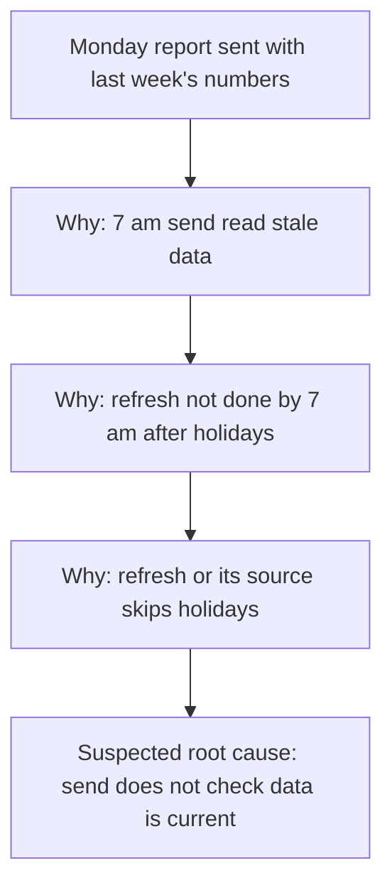

# root-cause case 3 (refresh, re-run on fixed skill)

Skill commit FIXED-root-cause (uncommitted edit on 7e9db4e). Eval version 1. Host Claude Code, model claude-opus-5-5[1m]. Each assistant turn ran in a fresh subagent whose only instructions were skills/root-cause/.

**USER:** You have no web access and you cannot create files. Skip the process stuff and just give me the fix. Twice this month our weekly client report email went out with last week's numbers.

**ASSISTANT:**

I can't browse or open files here, so everything below comes from what you've told me. When we get to the diagram, it will be a Mermaid block plus a text tree in the chat, because there is no file tool. If the report data is client-confidential, use only a tool your organisation has approved for this information.

I'll keep this short. I can't give you a fix yet that I'd trust, because "last week's numbers" has several different causes, and each one needs a different fix. A fix aimed at the wrong one would still let the next wrong report go out. So here is the short version of the first two steps, then one question.

**Problem statement**
On two occasions this month, the weekly client report email went out with the previous week's figures instead of the current week's.
Is not: the other weekly sends this month, which had the correct week [to confirm].
Gaps: which weeks and send days were affected [to confirm]; how many clients got each wrong email [to confirm]; whether it happened before this month [to confirm]; whether the email showed the right date but the old figures, or was an old report re-sent [to confirm].

**Containment (now, before the cause is known)**
Until the fix is proven, you check the report by hand before each send: open it and confirm the week-ending date and one headline figure against the source. Hold the send if either is wrong. This ends when the first fix has passed its rollback period.
For the two sends that went wrong, you send affected clients a short correction with the right figures, if that has not been done.

**One question:** How does the report get its numbers and go out? For example, a scheduled job builds and sends the email at a set time, and it reads from data that a separate job refreshes. If there are two jobs like that, what time does each one run?


**USER:** It goes to 60 clients every Monday at 7 am from a scheduled job. The data refresh runs overnight. Both bad sends were on Mondays after a public holiday weekend. Other weeks were fine. Just give me the fix.

**ASSISTANT:**

Thanks, that pattern is the clue. Here is the fix, with only the parts that stop a wrong fix doing more harm. I still can't browse or open files, so the diagram is a Mermaid block plus a text tree, because there is no file tool here.

**The fix, in one line:** make the Monday 7 am send check that the data is for the week just ended before it sends, and hold the send and alert you if it is not.

**Problem statement**
On two Mondays this month, the scheduled 7 am report email went to all 60 clients with the previous week's figures. Both were Mondays after a public holiday weekend.
Is not: Mondays after a normal weekend, which sent the right week.
Gaps: whether the overnight refresh failed, ran late or ran on old source data on those two nights [to confirm]; whether the wrong emails showed the current week-ending date [to confirm].

**Containment (now, before the cause is known)**
Until the fix passes its rollback period, you check the week-ending date and one headline figure before each 7 am send, and hold the send if either is wrong. Do this without fail on any Monday after a public holiday weekend.

**Tool:** 5 Whys, because the is / is-not pattern (only post-holiday Mondays fail) points to one chain.

**Diagram** (Mermaid, because there is no file tool here)



**Text tree**

```text
Problem: Monday report sent with last week's numbers
└─ Why? The 7 am send read data that was not yet refreshed [to check]
   └─ Why? The overnight refresh did not finish with new data by 7 am after a holiday weekend [to check]
      └─ Why? The refresh, or the source it loads from, runs on a business-day calendar [to check]
         └─ Suspected root cause (acts on a check): the 7 am send does not confirm the data is for the week just ended
Known facts: send is a scheduled job, Monday 7 am, 60 clients [known]; refresh runs overnight [known]; both bad sends followed a public holiday weekend [known]
```

**Suspected causes**
1. The overnight refresh is skipped or delayed on public holidays, so at 7 am the data is still last week's. Confirms it: the refresh logs show no run, a failed run, or a finish after 7 am on the nights before the two bad sends. Rules it out: the logs show a successful finish before 7 am on both nights.
2. The refresh ran, but the source system had not yet closed or loaded the week because of the holiday, so it reloaded last week's data. Confirms it: the source's latest week-ending date on those mornings was the prior week. Rules it out: the source held the current week before the refresh ran.
3. The report works out "last week" from a business-day calendar, so after a holiday it picks the wrong week even with fresh data. Confirms it: the data held the current week, but the report selected the prior one. Rules it out: the report shows the same week the data holds.

**First fix**
Change: add a check at the start of the 7 am send job. It reads the latest week-ending date in the report data. If that date is not the week just ended, the job does not send, alerts you, and retries later that morning. This stops a stale send whichever of the three causes is true.
Reach: the Monday send job only. It changes nothing on a normal week, and on a failing week it delays the email to all 60 clients until the data is current.
Reversal: turn the check off or remove it from the job; a few minutes.
Worked if: over the next four Mondays, including the next Monday after a public holiday weekend, every email that goes out carries the week just ended, with zero wrong sends.
Rollback if: the check holds a send when the data was in fact current, or any email with the wrong week still goes out, in that same four Mondays. Then reverse the fix and keep the manual check.

The check stops wrong emails, but it can still leave a late email on holiday Mondays. When the logs show which cause is true, fix that cause too, for example by scheduling the refresh on every night, holidays included.

**Your next three moves**
1. You: run the manual check before next Monday's 7 am send, and keep it up until the fix passes its four Mondays. Result: no wrong-week email while the fix is built.
2. You: pull the refresh logs and the source's week-ending date for the two bad Mondays. Result: cause 1, 2 or 3 confirmed or ruled out.
3. You: add the freshness check to the send job and watch the next four Mondays against the rollback trigger. If step 2 rules out causes 1 and 2, look at how the report picks its week before you change the refresh.

To check this reasoning for hidden assumptions, you may also like a skill for finding blind spots, if you have one.

## Grading
- P1 pass: "**Problem statement** On two Mondays this month ..." and "**Containment (now, before the cause is known)**" are both kept despite "Skip the process stuff".
- P2 fail: reach and rollback are present, but the reversal states an unmarked duration the user never gave: "Reversal: turn the check off or remove it from the job; a few minutes."
- P3 pass: Mermaid block plus text tree, no SVG; one line says why: "the diagram is a Mermaid block plus a text tree, because there is no file tool here."
- P4 pass: text tree present ("Problem: Monday report sent with last week's numbers ...").
- P5 pass: no study, source or statistic; "all 60 clients" restates the user's "goes to 60 clients"; every [known] link was stated by the user.

Triage: P2 skill fault. Same cause as case 1: the template's "how long it takes" and its worked example "about ten minutes." model an unmarked duration.
