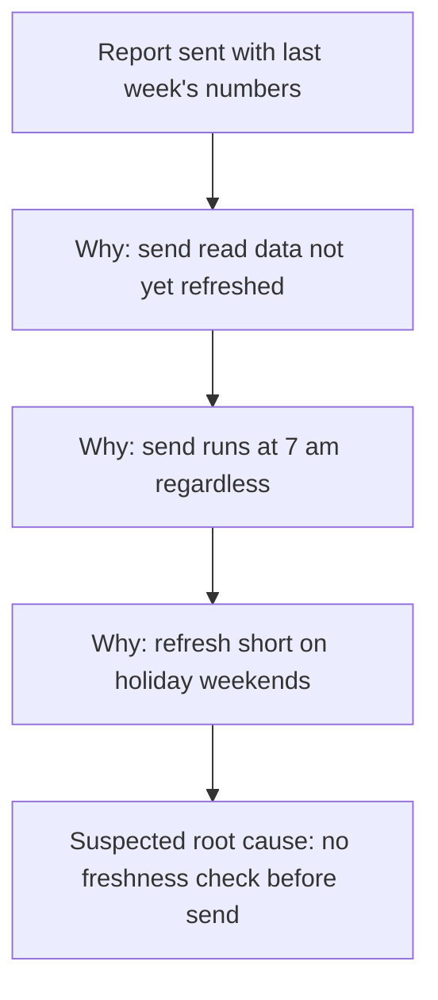

# root-cause case 3 (refresh, re-run 2 on fixed skill)

Skill commit FIXED-root-cause (second uncommitted edit on 7e9db4e). Eval version 1. Host Claude Code, model claude-opus-5-5[1m]. Each assistant turn ran in a fresh subagent whose only instructions were skills/root-cause/.

**USER:** You have no web access and you cannot create files. Skip the process stuff and just give me the fix. Twice this month our weekly client report email went out with last week's numbers.

**ASSISTANT:**

I can't browse or open files here, so everything below comes from what you've told me, and the diagram will be a text tree in the reply.

I'll keep this short, but I can't honestly hand you "the fix" yet. There are several different ways a weekly report can go out with last week's numbers, and each one needs a different fix. A fix aimed at the wrong one would look like it worked until it failed a third time. So here is where things stand, plus one quick question.

**Problem statement (draft)**
Twice this month, the weekly client report email went out with the previous week's numbers instead of the current week's.
- Where: the weekly client report email [to confirm: all clients, or only some?]
- When: two sends this month [to confirm: which weeks, and were the other sends this month correct?]
- How much: [to confirm: how many clients received each wrong report]
- Is not: [to confirm: the weeks when the report went out correct. The difference between the good weeks and the bad weeks is where the cause usually shows up.]

**Containment (until the fix is proven)**
Before each send, check that the report's "week ending" date and one headline number match the current week. If they don't match, hold the send. For the two wrong reports already sent, send those clients a short correction with the right numbers, if you haven't already.

**One question:** how does the report get its numbers? Does the email go out at a fixed time on its own schedule, separate from the job or person that refreshes the data behind it? Or does the send run only after the data refresh has finished?


**USER:** It goes to 60 clients every Monday at 7 am from a scheduled job. The data refresh runs overnight. Both bad sends were on Mondays after a public holiday weekend. Other weeks were fine. Just give me the fix.

**ASSISTANT:**

I can't browse or open files here, so this uses only what you've told me. There is no file tool, so the diagram is a Mermaid block plus a text tree.

The fix: make the Monday send check that this week's data is actually there before it goes, and hold it if not. The pattern you gave (only after holiday weekends, fine every other week) points to the refresh not producing this week's data on those Mondays while the 7 am send fires anyway. The gate stops that whatever the exact reason the refresh fell short. The detail is below.

**Problem statement**
Twice this month, the scheduled Monday 7 am report email went to 60 clients with the previous week's numbers. The data behind it comes from an overnight refresh that runs separately from the send. Both bad sends were on Mondays after a public holiday weekend.
Is not: Mondays after an ordinary weekend. Those sends were correct.
Gaps: whether the Monday itself was the public holiday [to confirm]; whether the refresh ran, failed or finished late on those two nights [to confirm].

**Containment (now, before the cause is known)**
Before each Monday send, you check that the report's "week ending" date and one headline number match the current week, and hold the send if they don't. Do this at least on every Monday after a public holiday. It ends when the first fix has passed its rollback period.

**Tool:** 5 Whys, because the holiday / non-holiday split points to one chain.

**Diagram (Mermaid)**



**Text tree**

```text
Problem: report sent with last week's numbers (2 sends, 60 clients each)
└─ Why? The send read data that did not yet hold this week [to check]
   └─ Why? The send runs at a fixed 7 am, separate from the refresh [known]
      └─ Why? On holiday weekends the refresh did not produce this week's data by 7 am [to check]
         └─ Suspected root cause (acts on process): the send has no check that the data is current before it goes
```

**Suspected causes**
1. The refresh follows a business-day calendar and skips or shifts its run over a public holiday. Confirms it: the scheduler history shows no refresh run (or a later run) on those two nights. Rules it out: the history shows a normal, successful run before 7 am on both nights.
2. The refresh ran, but the upstream data it pulls was not delivered over the holiday, so it reloaded last week's figures. Confirms it: the refresh log shows success, but the latest source records on those mornings are dated the previous week. Rules it out: the source held current-week records before the refresh started.
3. The refresh ran late (for example a bigger backlog after the long weekend) and finished after 7 am. Confirms it: the refresh finish time on both Mondays is after 7 am. Rules it out: both runs finished before 7 am.

**First fix**
Change: add a step at the start of the Monday send job that reads the "week ending" date in the report data (or the refresh's last successful completion time). If it is not the current week, the job holds the send and alerts you instead of emailing.
Reach: the one Monday report job and its 60 clients. Nothing else changes.
Reversal: disable or delete the check step so the job sends at 7 am as before; minutes [to confirm].
Worked if: across the next four Mondays, including the next Monday after a public holiday [to confirm when that is], every report that goes out shows the current week, and no correct report is held.
Rollback if: any report goes out with the wrong week, or the check holds a send on a Monday when the data was current. Then reverse the fix and keep the manual check.

Once you know which of the three causes it is, fix the refresh itself as well (for example, run it on holiday weekends or wait for the upstream data). The gate stays as the safety net.

**Your next three moves**
1. You: put the manual pre-send check in place for the next Monday this week. Result: a record that it ran and the send matched the current week.
2. You: pull the refresh job's history and the source data dates for the two bad Monday mornings. Result: a note of which of the three causes those records confirm or rule out.
3. You: if a cause is confirmed, add the freshness check to the send job and watch the rollback trigger for four Mondays. If all three are ruled out, re-rank what the records show and repeat step 2.

To check this reasoning for hidden assumptions, you might also like a skill for finding blind spots, if you have one.

## Grading
- P1 pass: despite "Skip the process stuff", both replies carry "Problem statement" and "Containment (now, before the cause is known)".
- P2 pass: "Reach: the one Monday report job and its 60 clients", "Reversal: disable or delete the check step ... minutes [to confirm]", "Rollback if: any report goes out with the wrong week, or the check holds a send on a Monday when the data was current".
- P3 pass: Mermaid block plus text tree, no SVG; one line says why: "There is no file tool, so the diagram is a Mermaid block plus a text tree."
- P4 pass: "Text tree" block present in the take-away.
- P5 pass: no study, source or statistic; "for example a bigger backlog after the long weekend" is labelled as an example inside a suspected cause.
- Strict check pass: "The send runs at a fixed 7 am, separate from the refresh [known]" restates "scheduled job ... 7 am" and "The data refresh runs overnight"; "60 clients each" restates the user; owner is "You"; "the next Monday after a public holiday [to confirm when that is]" is marked.

Triage:
