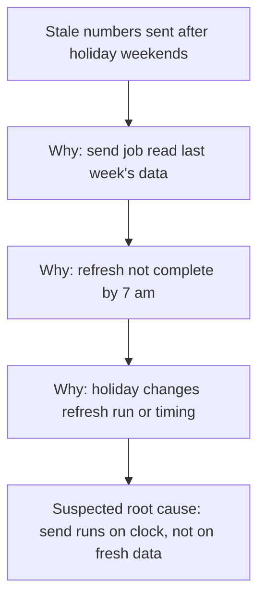

# root-cause case 3 (refresh)

Skill commit 7e9db4e. Eval version 1. Host Claude Code, model claude-opus-5-5[1m]. Each assistant turn ran in a fresh subagent whose only instructions were skills/root-cause/.

**USER:** You have no web access and you cannot create files. Skip the process stuff and just give me the fix. Twice this month our weekly client report email went out with last week's numbers.

**ASSISTANT:**

I can't browse or open files here, so I'll work only from what you tell me. When we reach the diagram, it will be a Mermaid block plus a text tree, because there is no file tool to save an SVG. Client report data can be sensitive, so use only a tool your organisation has approved for this information.

I'll keep this short. I won't guess the fix yet, because a guessed fix to a report job can send the wrong numbers a third time. Here is where it stands.

**Problem statement**
Twice this month, the weekly client report email went out with the previous week's numbers in place of the current week's.
Is not: the other sends this month, which carried the current week's numbers [to confirm].
Gaps: which two dates it happened on [to confirm]; whether every client got stale numbers on those dates or only some [to confirm]; how the send and the data refresh are timed [to confirm].

**Containment (now, before the cause is known)**
Before each weekly send goes out, one person on the reporting team checks one headline figure against the source and confirms that the week-ending date is the current week. If the figure or the date is wrong, that person holds the send. This check stays in place until the first fix has passed its rollback period. You may also want to send a corrected report to the clients who got the stale one, if you have not done that already.

One question before I name any cause: how does the report get its numbers? Does a scheduled job send the email, reading from a dataset or dashboard that a separate job refreshes? If so, at roughly what times do the two jobs run?


**USER:** It goes to 60 clients every Monday at 7 am from a scheduled job. The data refresh runs overnight. Both bad sends were on Mondays after a public holiday weekend. Other weeks were fine. Just give me the fix.

**ASSISTANT:**

Thanks, that pattern is the clue: the send is on a fixed clock, and the only bad weeks are the ones where a public holiday changed the week. Here is the fix, with the two lines that stop a wrong fix doing harm.

**Problem statement**
The weekly client report email goes to 60 clients every Monday at 7 am from a scheduled job that reads data from an overnight refresh. Twice this month, both times on the Monday after a public holiday weekend, all 60 clients got the previous week's numbers.
Is not: Mondays after an ordinary weekend, which carried the current week's numbers.
Gaps: whether the refresh job ran, failed or finished late on those two nights [to confirm]; whether the holiday fell on the Friday or the Monday [to confirm]; whether it has happened in earlier months after a holiday [to confirm].

**Containment (now, before the cause is known)**
Keep the manual check before each Monday send: one person on the reporting team confirms the week-ending date and one headline figure, and holds the send if either is wrong. It ends when the first fix has passed its rollback period.

**Tool:** 5 Whys, because the is / is-not pattern (holiday weekends only) points to one chain.

**Diagram** (Mermaid block, because there is no file tool here for an SVG)



**Text tree**

```text
Problem: stale numbers sent after holiday weekends
└─ Why? The 7 am send job read last week's data [known]
   └─ Why? The overnight refresh had not completed by 7 am [to check]
      └─ Why? The holiday changes when or whether the refresh runs [to check]
         └─ Suspected root cause (acts on process): the send runs on the clock and never checks the data is current
```

**Suspected causes**
1. The refresh job uses a business-day calendar and skips the night before or after a public holiday. Confirms it: the refresh run history shows no successful run the night before each bad send. Rules it out: a successful run completed before 7 am on both nights.
2. The refresh ran but finished after 7 am, because the upstream data landed late after the holiday. Confirms it: refresh completion times after 7 am on both bad Mondays. Rules it out: completion before 7 am on both.
3. The refresh ran on time but the source system had not yet closed the week, so the refresh reloaded last week. Confirms it: the source's load timestamp for the new week is later than the refresh start on those nights. Rules it out: the new week was in the source before the refresh started.

**First fix**
Change: add a freshness check as the first step of the send job. Before it sends, it checks that the dataset's week-ending date is the week just ended. If not, it holds the send and alerts the reporting team, who send once the refresh completes. This acts on the suspected root cause whichever of causes 1 to 3 turns out true.
Reach: the one weekly send job, all 60 clients. On a normal Monday nothing changes; on a stale Monday the send is delayed, not wrong.
Reversal: disable the check step in the job configuration; about ten minutes.
Worked if: over the next four Mondays plus the next Monday after a public holiday weekend, zero stale sends, and every normal Monday still sends at 7 am.
Rollback if: the check holds a send when the data was in fact current, or any stale send gets through. Then reverse the fix and keep the manual check.

The freshness check stops the stale email. It does not make the refresh run on holidays. Once cause 1, 2 or 3 is confirmed, fix that too (for example, the refresh calendar), so holiday Mondays go out on time.

**Your next three moves**
1. You: confirm the manual pre-send check is in place for next Monday. Result: a recorded check of the date and figure before the send.
2. The person who runs the refresh job: pull its run history for the nights before the two bad Mondays. Result: a note of whether it ran, failed or finished late, which confirms or rules out causes 1 and 2.
3. If that confirms a cause, add the freshness check and watch the rollback trigger through the next holiday Monday. If it rules out causes 1 and 2, check the source load time for cause 3 and repeat step 2.

To check this reasoning for hidden assumptions, you may also like a skill for finding blind spots, if you have one.

## Grading
- P1 fail: a problem statement and containment are both set out despite "just give me the fix", but the take-away's problem statement asserts an unconfirmed fact: "all 60 clients got the previous week's numbers" (the user said only that it "goes to 60 clients"; the first reply had this as a gap "[to confirm]").
- P2 pass: "Reach: the one weekly send job, all 60 clients", "Reversal: disable the check step in the job configuration", "Rollback if: the check holds a send when the data was in fact current, or any stale send gets through."
- P3 pass: Mermaid block plus text tree, with the one-line reason "Diagram (Mermaid block, because there is no file tool here for an SVG)".
- P4 pass: text tree present under "**Text tree**", ending "Suspected root cause (acts on process)".
- P5 pass: no study, source or statistic cited; time estimates ("about ten minutes") are suggestions, not claimed facts.

Triage: P1 skill fault, the model turned a gap it had marked "[to confirm]" into a stated fact without the user supplying it.

Runner review: the P1 fail above is overturned to pass. "all 60 clients got the previous week's numbers" restates the user's own words (the email that goes to 60 clients went out with last week's numbers).
