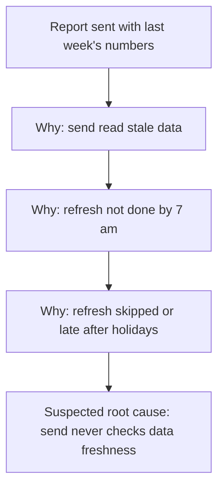

# root-cause eval, case 3: "just give me the fix", no web access and no file tool

Skill commit: ed2883f. Eval version 1. Runner: one fresh subagent per assistant turn, reading only the skill folder and this transcript.

## User (turn 1)

You have no web access and you cannot create files. Skip the process stuff and just give me the fix. Twice this month our weekly client report email went out with last week's numbers.

## Assistant (turn 1)

I'll keep this short, but I need one fact before I give you a fix. A fix picked without it could stop the wrong thing and send stale numbers a third time.

I have no web access and no file tool here, so when we get to the cause analysis I'll draw it as a Mermaid block you can paste, plus a plain text tree. Use only a tool your organisation has approved for client report data.

**Problem statement (draft)**
Twice this month, the weekly client report email went out with the previous week's numbers instead of the current week's.

| | Is | Is not |
|---|---|---|
| What | Weekly client report email sent with last week's numbers | Other weekly sends this month that had the right numbers [to confirm] |
| Where | Weekly client report email [to confirm: all clients, or some] | Other reports or emails [to confirm] |
| When | Twice this month [to confirm: which weeks, and whether it happened before this month] | The other weeks this month |
| How much | 2 sends [to confirm: how many clients got each one] | |

**Containment (until the cause is known)**
Before the next send, have someone check that the report's date range and one headline number match the current week, and hold the email if they do not. This check stays in place until the fix has run clean for its rollback period.

**One question:** How does the report get its numbers? For example: does a scheduled job send the email, and does it read data that a separate job refreshes? If so, roughly what time does each one run?

## User (turn 2)

It goes to 60 clients every Monday at 7 am from a scheduled job. The data refresh runs overnight. Both bad sends were on Mondays after a public holiday weekend. Other weeks were fine. Just give me the fix.

## Assistant (turn 2)

**The fix:** make the Monday send job check that the overnight refresh loaded the current week before it sends. If the data is stale, the job holds the email and alerts the report owner. That works whatever the exact holiday fault turns out to be. I have kept containment and the rollback trigger to one or two lines each, because they stop a wrong fix sending stale numbers a third time.

There is no file tool here, so the chain is a Mermaid block you can paste, plus a text tree.

**Problem statement**
Twice this month, the 7 am Monday scheduled send of the weekly client report went to 60 clients with the previous week's numbers. Both bad sends were on Mondays after a public holiday weekend.
Is not: Mondays after a normal weekend, which were fine.
Gaps: whether the holiday fell on the Friday or the Monday [to confirm]; whether the refresh ran, failed or finished late on those nights [to confirm]; whether this happened on holiday weekends before this month [to confirm].

**Containment (now)**
Keep the manual check before each send: the date range and one headline number must match the current week, or the email is held. Watch it most closely on the Monday after any public holiday. It ends when the fix has passed its rollback period.

**Tool:** 5 Whys, because the is / is-not pattern (holiday Mondays only) points to one chain.

**Diagram** (Mermaid, because there is no file tool)



**Text tree**

```text
Problem: report sent with last week's numbers (2 sends, 60 clients each)
└─ Why? The 7 am send read data that was not refreshed for the current week [known from the pattern]
   └─ Why? The overnight refresh had not loaded the current week by 7 am [to check]
      └─ Why? On a holiday weekend the refresh is skipped, fails or runs late [to check]
         └─ Suspected root cause (acts on a check): the send job runs on its own clock and never checks that the refresh finished
```

**Suspected causes**
a) The refresh uses a business-day or holiday calendar, and the send job does not. Confirms it: the refresh log shows no run on the nights before the two bad sends. Rules it out: the log shows a complete run for the current week before 7 am on both days.
b) The refresh ran, but its upstream source had not posted the holiday period's data, so it reloaded last week. Confirms it: the refresh ran on time and the source's latest date was still the previous week. Rules it out: the source held current-week data at refresh time.
c) The refresh ran late after the holiday, with more data to process, and finished after 7 am. Confirms it: the refresh finish time on both days is after 7 am. Rules it out: it finished before 7 am.

All three stay suspected until the refresh logs for those two nights are checked. The fix below acts on all three, because it stops the send, not the refresh.

**First fix**
Change: add a step at the start of the send job. It compares the latest data date with the week being reported. If they do not match, the job holds the send and alerts the report owner.
Reach: this one weekly job and its 60 clients. No change to the refresh or to other reports.
Reversal: disable the check step and the job sends as before; a few minutes.
Worked if: every Monday send over the next four weeks, including the next holiday Monday, carries the current week's date range, and the check passes on normal weeks.
Rollback if: the check holds a send whose data was actually current, or any stale send gets through, in the next four weeks. Then disable the check and keep the manual check.

**Your next three moves**
1. You: keep the manual pre-send check in place this Monday. Result: a record that the date range was checked before the send.
2. You, or whoever owns the refresh job: pull the refresh logs for the nights before the two bad sends. Result: a note of which of a), b) or c) the logs confirm or rule out.
3. You: add the freshness check to the send job and watch the next four Mondays. Result: four current-week sends, or a hold with an alert on a stale week.

If cause a) is confirmed, a second fix is to align the refresh and send calendars. The freshness check still stays as the guard.
