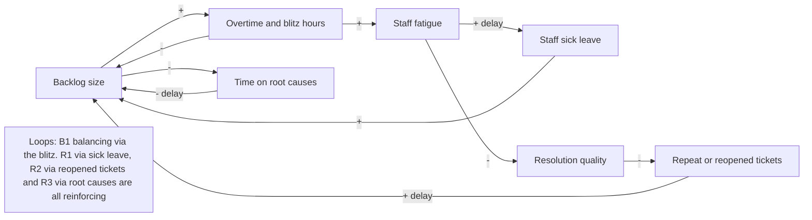

# systems-map case 1 transcript, 2026-09-29 (refresh)

Runner: one fresh subagent per assistant turn, given only the skill folder and this transcript. Model: claude-opus-5-5[1m]. Skill commit: 7e9db4e. Eval version: 2.

**USER:** Help me map why our support backlog keeps coming back.

**ASSISTANT:**

Happy to map it with you. We will go one step at a time: the pattern, the variables, the links between them, the loops, then one leverage point to test.

Use only a tool your organisation has approved for this information.

A systems map explains a pattern over time, so let's start there. What keeps happening with the backlog, how has it changed over time (rough numbers help, such as ticket counts or wait times by month), and what has your team tried so far to clear it?

**USER:** Every quarter the backlog spikes. We pull people onto overtime and weekend blitzes, it drops, then about two months later it is back and higher. It has been like this for 18 months.

**ASSISTANT:**

That is a clear pattern over time. The backlog spikes every quarter, overtime and weekend blitzes bring it down, and about two months later it comes back higher than before. This has repeated for 18 months.

The next step is to list the variables. Each variable is something that can go up or down. From what you said, I suggest these six:

- **Backlog size**: the number of open support tickets.
- **Overtime and blitz hours**: the extra hours your team works to clear the backlog.
- **Staff fatigue**: how tired and stretched the team is after a blitz.
- **Resolution quality**: how well each ticket is fixed the first time. `[to confirm]`
- **Repeat or reopened tickets**: tickets that come back because the first fix did not hold. `[to confirm]`
- **Time on root causes**: the time the team spends fixing what creates tickets, such as product defects or unclear documentation. `[to confirm]`

I added the last three from general experience of support teams. You did not mention them, so they stay suggestions until you confirm them.

Is this list right? Please confirm, correct or add to it in one reply. For example, you could add the rate of new incoming tickets, headcount, or anything else that changes around the quarterly spike.

**USER:** Yes, and add staff sick leave.

**ASSISTANT:**

Thank you. The list now has seven variables: backlog size, overtime and blitz hours, staff fatigue, resolution quality, repeat or reopened tickets, time on root causes, and staff sick leave.

The next step is to link them. Each link has a polarity. `+` means both variables move the same way. `-` means they move opposite ways. `||` marks a delay. Two links come from your own words, so I rate them "you". The rest are my suggestions until you confirm them.

| # | From | To | Polarity | Delay | Reason | Rated by |
|---|---|---|---|---|---|---|
| a | Backlog size | Overtime and blitz hours | + | | When the backlog spikes, you pull people onto overtime and blitzes. | you |
| b | Overtime and blitz hours | Backlog size | - | | The blitzes bring the backlog down. | you |
| c | Overtime and blitz hours | Staff fatigue | + | | More extra hours make the team more tired. | suggested |
| d | Staff fatigue | Staff sick leave | + | `\|\|` | Tired people take more sick leave, some weeks later. | suggested |
| e | Staff sick leave | Backlog size | + | | Fewer people at work means fewer tickets closed, so the backlog grows. | suggested |
| f | Staff fatigue | Resolution quality | - | | Tired people fix tickets less well the first time. | suggested |
| g | Resolution quality | Repeat or reopened tickets | - | | Better first fixes mean fewer tickets come back. | suggested |
| h | Repeat or reopened tickets | Backlog size | + | `\|\|` | Reopened tickets land back in the queue, some weeks after the blitz. | suggested |
| i | Backlog size | Time on root causes | - | | A big backlog pulls people off root-cause work to fight fires. | suggested |
| j | Time on root causes | Backlog size | - | `\|\|` | Fixing what creates tickets means fewer new tickets, but only after a delay. | suggested |

The delays on links d, h and j are my guess at why the backlog returns about two months after each blitz. That timing is `[to confirm]`.

Are these links right? Please confirm, correct or add to them in one reply. If you are not sure of the direction of a link, say so and I will mark it `?` rather than guess.

**USER:** Looks right.

**ASSISTANT:**

Thank you. You confirmed all ten links, so every link in the table is now rated "you". The exact length of the delays on links d, h and j is still `[to confirm]`; the only timing we have is your "about two months".

The next step is to find the loops. I traced each closed loop and counted its `-` links. An even count (zero included) makes a loop reinforcing (R). An odd count makes it balancing (B).

| Loop | Path | `-` links | Type | Story |
|---|---|---|---|---|
| B1 | Backlog size → overtime and blitz hours → backlog size (a, b) | 1 | Balancing | The backlog spikes, the team does a blitz, and the backlog drops. |
| R1 | Backlog size → overtime and blitz hours → staff fatigue → staff sick leave `\|\|` → backlog size (a, c, d, e) | 0 | Reinforcing | Each blitz tires the team, sick leave rises some weeks later, and fewer tickets get closed. |
| R2 | Backlog size → overtime and blitz hours → staff fatigue → resolution quality → repeat or reopened tickets `\|\|` → backlog size (a, c, f, g, h) | 2 | Reinforcing | Tired people fix tickets less well, and the weak fixes come back into the queue weeks later. |
| R3 | Backlog size → time on root causes `\|\|` → backlog size (i, j) | 2 | Reinforcing | A big backlog pulls people off root-cause work, so the causes of new tickets stay in place. |

So one loop brings the backlog down fast, and three loops push it back up, two of them through the blitz itself and all three with a delay. That fits your pattern: a quick drop, then a return about two months later, higher than before.

Next is the archetype, which is a common loop structure that produces a familiar pattern. Two fit your map:

- **Fixes that fail.** A fix works at once, the problem returns later, often worse, and the same fix is applied again. Your evidence: the blitz makes the backlog drop (B1), then "about two months later it is back and higher", and you run the same blitz again, for 18 months. R1 and R2 are the delayed side effects of the fix itself.
- **Shifting the burden.** A quick fix eases the symptom each time, while the real fix is slow and keeps being put off. Here the quick fix is overtime and blitzes (B1), and the real fix is time on root causes (R3), which the backlog keeps crowding out. The evidence is thinner: it rests on the root-cause links, which came from me and which you confirmed, rather than on your own description.

My suggestion is Fixes that fail, because your own words describe it almost exactly. Shifting the burden may also be true underneath it.

Which fits your situation best: Fixes that fail, Shifting the burden, both, neither, or your call?

**USER:** Fixes that fail sounds right.

**ASSISTANT:**

Thank you. The archetype is Fixes that fail, confirmed by you. The evidence is in your own words: the blitz brings the backlog down, "about two months later it is back and higher", and the same blitz runs again, for 18 months.

The next step is the leverage point. The usual leverage for Fixes that fail is to name the delayed side effect and treat it, or to change the fix so it stops feeding the side effect. In your map, the side effects are staff fatigue, which feeds sick leave (R1) and weaker first fixes that come back as reopened tickets (R2).

**Leverage point (a hypothesis):** put a rule on the blitz itself. Cap the overtime and blitz hours each person works per blitz, at a level `[to confirm]`, and use the capped hours on the oldest and most-reopened tickets first.

- **Level on Meadows' list:** level 5, the rules of the system. The rule weakens the gain of the two reinforcing loops, R1 and R2, because less fatigue should mean less sick leave and better first fixes.
- **Why this point:** it keeps the fix that works (B1) and limits the part of the fix that drives the return. It is also a change a support lead can usually make without a budget.
- **Small test:** at the next quarterly spike, run the blitz with the cap. Then compare reopened tickets and sick leave in the weeks after it with the same measures after the last blitz. The length of the test and the size of the cap are `[to confirm]`. Before you start, write down what you expect: if the hypothesis holds, the backlog should return later or lower than about two months and higher.

This is a hypothesis, not a proven fix. The test shows whether it works in your system.

Can you set a cap like this on blitz hours yourself, or who can?

**USER:** I run the support team, so I can change how we triage, but not the headcount.

**ASSISTANT:**

Thank you. That settles it: you control triage, so the leverage point should run through triage, not through headcount. I have refitted it below. Whether you can also set a cap on overtime hours per person is `[to confirm]`, so the cap is now an optional add-on rather than the core of the change.

Here is the full map.

**Pattern over time:** every quarter the backlog spikes. The team is pulled onto overtime and weekend blitzes, the backlog drops, then about two months later it is back and higher. This has repeated for 18 months. Headcount is fixed and outside your control.

| From | To | Polarity | Delay | Rated by |
|---|---|---|---|---|
| Backlog size | Overtime and blitz hours | + | no | you |
| Overtime and blitz hours | Backlog size | - | no | you |
| Overtime and blitz hours | Staff fatigue | + | no | you |
| Staff fatigue | Staff sick leave | + | yes | you |
| Staff sick leave | Backlog size | + | no | you |
| Staff fatigue | Resolution quality | - | no | you |
| Resolution quality | Repeat or reopened tickets | - | no | you |
| Repeat or reopened tickets | Backlog size | + | yes | you |
| Backlog size | Time on root causes | - | no | you |
| Time on root causes | Backlog size | - | yes | you |

**Loops**

- B1: backlog size -> overtime and blitz hours -> backlog size. Balancing, one "-" link. The blitz brings the backlog down fast.
- R1: backlog size -> overtime and blitz hours -> staff fatigue -> staff sick leave -> backlog size. Reinforcing, zero "-" links. Each blitz tires the team, and sick leave some weeks later cuts the tickets closed.
- R2: backlog size -> overtime and blitz hours -> staff fatigue -> resolution quality -> repeat or reopened tickets -> backlog size. Reinforcing, two "-" links. Tired people fix tickets less well, and the weak fixes come back weeks later.
- R3: backlog size -> time on root causes -> backlog size. Reinforcing, two "-" links. A big backlog crowds out root-cause work, so the sources of new tickets stay in place.

```text
Links
  backlog size --(+)--> overtime and blitz hours
  overtime and blitz hours --(-)--> backlog size
  overtime and blitz hours --(+)--> staff fatigue
  staff fatigue --(+ ||)--> staff sick leave            delay on this link
  staff sick leave --(+)--> backlog size
  staff fatigue --(-)--> resolution quality
  resolution quality --(-)--> repeat or reopened tickets
  repeat or reopened tickets --(+ ||)--> backlog size   delay on this link
  backlog size --(-)--> time on root causes
  time on root causes --(- ||)--> backlog size          delay on this link

Loops
  B1: backlog size -> overtime and blitz hours -> backlog size   balancing, 1 "-" link (odd)
  R1: backlog size -> overtime and blitz hours -> staff fatigue -> staff sick leave -> backlog size   reinforcing, 0 "-" links (even)
  R2: backlog size -> overtime and blitz hours -> staff fatigue -> resolution quality -> repeat or reopened tickets -> backlog size   reinforcing, 2 "-" links (even)
  R3: backlog size -> time on root causes -> backlog size   reinforcing, 2 "-" links (even)
```

There is no file tool or live preview here, so the diagram is a Mermaid flowchart in a code block for you to paste into any Mermaid viewer.



**Archetype:** Fixes that fail, confirmed by you. Evidence: the blitz brings the backlog down, "about two months later it is back and higher", and the same blitz has run again every quarter for 18 months.

**Leverage point (hypothesis):** change the triage rule for each blitz. During a blitz, reopened tickets and tickets that share a known cause go to the front of the queue, and a fixed share of blitz hours `[to confirm]` goes to fixing the cause behind the most common ticket type. If you can also cap overtime hours per person, add that cap; whether it is yours to set is `[to confirm]`. Level 5 on Meadows' list: the rules of the system. Why: the new rule works on R2, because first fixes on repeat tickets should stop them coming back, and on R3, because root-cause time no longer drops to zero when the backlog is high. The cap, if you can set it, also weakens R1. Small test: run the next quarterly blitz under the new triage rule. Then compare reopened tickets and the date the backlog starts to climb again with the same measures after the last blitz. The share of hours, the length of the comparison window and how often you record the measures are `[to confirm]`. It works if the backlog comes back later or lower than "about two months and higher".

**What you do not know yet:**

- The exact length of the three delays (fatigue to sick leave, reopened tickets to backlog, root-cause work to backlog). The only timing we have is your "about two months".
- Whether you can set a cap on overtime hours per person.
- The share of blitz hours for root-cause work, the test's comparison window and how often you record the measures.
- Three variables (resolution quality, repeat or reopened tickets, time on root causes) and eight links first came from me. You confirmed them all, but nobody has checked them against your ticket data yet.

## Next

1. **Owner: you.** This week, pull the reopened-ticket count and the sick-leave record for the weeks after the last blitz, and check whether they rose the way links d and h say. Result: a note of which links your data supports and which it does not.
2. **Owner: you.** This week, write the new blitz triage rule and your prediction for the next blitz (when the backlog starts to climb again, and how high) before the next spike. Result: a written rule and a written prediction to compare against.
3. **Owner: you.** This week, pick one measure that shows whether the pattern is changing, such as reopened tickets per week, and start recording it on the same day each week. Result: a running record that shows the next return earlier than the backlog does.

This map was built from what you told me in this chat; I did not open any files or data.

## Grading

- P1: pass. Reply 1 gives the approved-tool line and asks one question about the pattern; no archetype, no loop.
- P2: pass. Replies 2 to 5 each end with one question (variables, links, archetype, who can act).
- P3: pass. Text notation has a polarity on all ten links; B1 one "-" (B), R1 zero, R2 two, R3 two (all R).
- P4: pass. "the diagram is a Mermaid flowchart" plus the text notation; no image generation.
- P5: pass. "Fixes that fail, confirmed by you" with the blitz and "about two months later it is back and higher"; staff sick leave is a variable.
- P6: pass. Leverage point is a blitz triage rule, "Level 5 on Meadows' list", "(hypothesis)", with a small test; three moves owned by "you" with action this week and result; no invented person or date.
