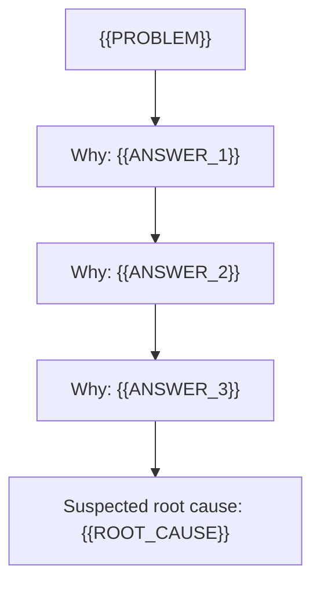
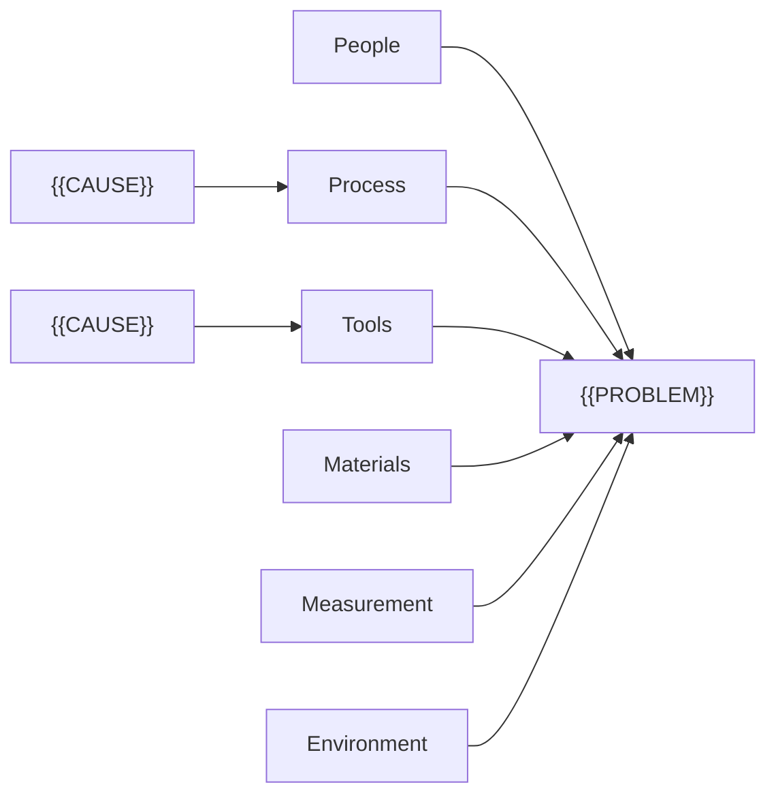

# Diagrams

Use the diagram ladder: SVG, then Mermaid, then a text tree or table. Never use image
generation. Always give the text tree or table as well.

Rules for every rung:

- Keep labels short (under about six words) and exactly as in the analysis.
- Insert user text as text. In SVG, escape `&`, `<`, `>` and `"`. In Mermaid, put each label
  in double quotes and replace any `"` inside it with `'`.
- No external requests, no remote fonts, no `<script>`, no event-handler attributes.
- Label the last link "Root cause" only when every why above it is marked "[known]". If any
  why in the chain is still "[to check]", label the last link "Suspected root cause" instead,
  so the diagram never claims a cause as confirmed before its evidence is in.

## Text tree (always)

5 Whys chain, every link confirmed:

```text
Problem: {{PROBLEM}}
└─ Why? {{ANSWER_1}} [known]
   └─ Why? {{ANSWER_2}} [known]
      └─ Why? {{ANSWER_3}} [known]
         └─ Root cause (acts on process): {{ROOT_CAUSE}}
```

5 Whys chain, a link still unconfirmed:

```text
Problem: {{PROBLEM}}
└─ Why? {{ANSWER_1}} [known]
   └─ Why? {{ANSWER_2}} [known]
      └─ Why? {{ANSWER_3}} [to check]
         └─ Suspected root cause (acts on process): {{ROOT_CAUSE}}
```

Fishbone:

```text
Problem: {{PROBLEM}}
├─ People: {{CAUSE}}; {{CAUSE}}
├─ Process: {{CAUSE}} (suspected)
├─ Tools: {{CAUSE}}
├─ Materials: {{CAUSE}}
├─ Measurement: {{CAUSE}}
└─ Environment: {{CAUSE}}
```

Pareto table (S4):

```text
| Category | Count | Share | Cumulative |
|---|---|---|---|
| {{CATEGORY}} | {{N}} | {{P}}% | {{C}}% |
| Other | {{N}} | {{P}}% | 100% |
```

## Mermaid (S8)

5 Whys chain (use "Root cause" only if every why is confirmed, otherwise "Suspected root cause"):



Fishbone (as a left-to-right tree; drop empty branches):



## SVG (fishbone)

Copy the frame, keep the spine and six branches, and add one `<text>` per cause beside its
branch. Drop a branch with no causes. Mark a suspected cause with `font-weight="bold"`.

```svg
<svg xmlns="http://www.w3.org/2000/svg" viewBox="0 0 900 420" font-family="sans-serif" font-size="14">
  <rect width="900" height="420" fill="#ffffff"/>
  <line x1="40" y1="210" x2="700" y2="210" stroke="#222" stroke-width="3"/>
  <rect x="700" y="180" width="180" height="60" fill="#f2f2f2" stroke="#222"/>
  <text x="790" y="215" text-anchor="middle">{{PROBLEM}}</text>
  <line x1="160" y1="60" x2="240" y2="210" stroke="#222"/>
  <line x1="380" y1="60" x2="460" y2="210" stroke="#222"/>
  <line x1="600" y1="60" x2="680" y2="210" stroke="#222"/>
  <line x1="160" y1="360" x2="240" y2="210" stroke="#222"/>
  <line x1="380" y1="360" x2="460" y2="210" stroke="#222"/>
  <line x1="600" y1="360" x2="680" y2="210" stroke="#222"/>
  <text x="160" y="50" text-anchor="middle" font-weight="bold">People</text>
  <text x="380" y="50" text-anchor="middle" font-weight="bold">Process</text>
  <text x="600" y="50" text-anchor="middle" font-weight="bold">Tools</text>
  <text x="160" y="385" text-anchor="middle" font-weight="bold">Materials</text>
  <text x="380" y="385" text-anchor="middle" font-weight="bold">Measurement</text>
  <text x="600" y="385" text-anchor="middle" font-weight="bold">Environment</text>
  <text x="200" y="120">{{CAUSE}}</text>
</svg>
```

For a 5 Whys chain or a Pareto chart as SVG, use boxes joined by arrows, or bars sorted
largest first with the cumulative share as text above each bar.
