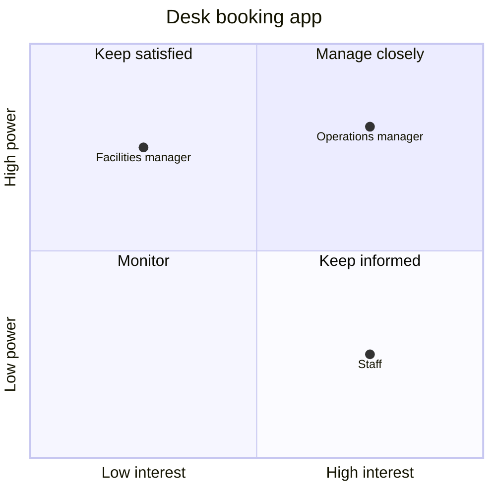

# Take-away template

Fill every line. Keep the order.

```md
Power and interest ratings about named people are sensitive. Share this map only with the people who need it.

**Change:** [the change or decision]. **Decides:** [who decides, or [to confirm]].

| Stakeholder | Power | Interest | Rated by | Quadrant | Cares about | Message |
|---|---|---|---|---|---|---|
| [name, role or group as the user wrote it] | [high or low] | [high or low] | [you, or suggested: one-line reason] | [Manage closely, Keep satisfied, Keep informed or Monitor] | [what the user said, or [to confirm]: question to ask them] | "[one or two sentences]" [plus "[depends on: concern to confirm]" when the concern is unknown] |

[One line naming the diagram rung and why.]

[The diagram at that rung.]

**What you do not know yet:** [each [to confirm] item and each suggested rating, or "Nothing: you confirmed every rating and concern."]
```

## Worked example (short)

A team lead maps a change to the office booking system. The user confirmed every rating and
gave every concern except the facilities manager's.

Power and interest ratings about named people are sensitive. Share this map only with the
people who need it.

**Change:** move desk booking to the new app by the end of the quarter. **Decides:** the
operations manager.

| Stakeholder | Power | Interest | Rated by | Quadrant | Cares about | Message |
|---|---|---|---|---|---|---|
| Operations manager | high | high | you | Manage closely | Fewer empty desks | "Can we agree the two weekly reports that show desk use, so you can judge the app on empty desks?" |
| Facilities manager | high | low | you | Keep satisfied | [to confirm]: "What would make this change easy for your team?" | "The app goes live at the end of the quarter and needs no change to the floor plan." [depends on: concern to confirm] |
| Staff | low | high | you | Keep informed | Getting a desk near their team | "From next quarter you can book a desk near your team a week ahead. We will update you each fortnight, and you can raise a concern at any time." |

There is no file tool here, so the grid is a Mermaid block.



**What you do not know yet:** what the facilities manager cares about.
