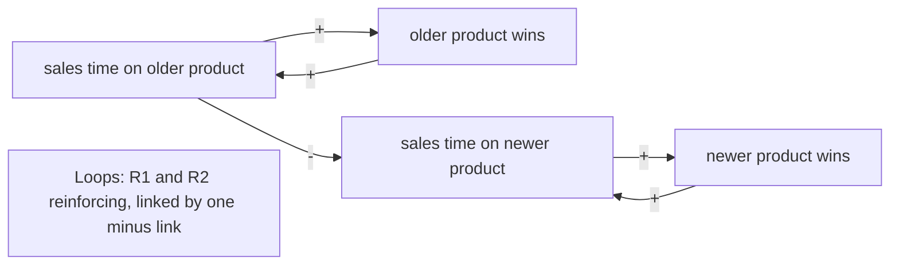

# Take-away template

Fill every line. Keep the order. In a table cell, escape any `|` in the user's own text as
`\|` and replace a line break with a space or `<br>`, so the table still renders.

```md
**Pattern over time:** [what keeps happening, over what period, and what has been tried, in the user's words and numbers].

| From | To | Polarity | Delay | Rated by |
|---|---|---|---|---|
| [variable] | [variable] | [+, - or ? [to confirm]] | [yes or no] | [you, or suggested: one-line reason] |

**Loops**

- [R1, B1, or ?1]: [variable] -> [variable] -> [variable]. [Reinforcing, balancing, or type unknown until [link] is confirmed]. [One-line story of what the loop does.]

[The causal loop in text notation, from references/diagrams.md.]

[One line naming the diagram rung and why.]

[The diagram at that rung.]

**Archetype:** [name, confirmed by you | name, suggested | no standard archetype fits]. Evidence: [the user's words that match its signs, or, when none fits, why the nearest one does not].

**Leverage point (hypothesis):** [what to change]. Level [n] on Meadows' list: [place to intervene]. Why: [which loop it weakens or strengthens]. Small test: [what to try, for how long, and what result would show it works].

**What you do not know yet:** [each ? link, each suggested link and each [to confirm] item, or "Nothing: you confirmed every link."]
```

## Worked example (short)

A sales director sees two product lines share one sales team. The user confirmed every link
and picked the archetype. The leverage point is still a hypothesis.

**Pattern over time:** over the last four quarters, the older product's sales rose each
quarter and the newer product's fell, while both kept the same targets. Nothing has been tried
yet.

| From | To | Polarity | Delay | Rated by |
|---|---|---|---|---|
| sales time on older product | older product wins | + | no | you |
| older product wins | sales time on older product | + | no | you |
| sales time on older product | sales time on newer product | - | no | you |
| sales time on newer product | newer product wins | + | no | you |
| newer product wins | sales time on newer product | + | no | you |

**Loops**

- R1: sales time on older product -> older product wins -> sales time on older product.
  Reinforcing, zero "-" links. Wins attract more selling time.
- R2: sales time on newer product -> newer product wins -> sales time on newer product.
  Reinforcing, zero "-" links. The same loop runs down for the newer product.

```text
Links
  sales time on older product --(+)--> older product wins
  older product wins --(+)--> sales time on older product
  sales time on older product --(-)--> sales time on newer product
  sales time on newer product --(+)--> newer product wins
  newer product wins --(+)--> sales time on newer product

Loops
  R1: sales time on older product -> older product wins -> sales time on older product   reinforcing, 0 "-" links
  R2: sales time on newer product -> newer product wins -> sales time on newer product   reinforcing, 0 "-" links
```

There is no file tool here, so the Mermaid flowchart is in a code block for you to paste.



**Archetype:** Success to the successful, confirmed by you. Evidence: "both products share one
sales team" and "the older product keeps winning, so the team spends more time on it".

**Leverage point (hypothesis):** give the newer product its own protected selling hours. Level
5 on Meadows' list: the rules of the system. Why: it cuts the link that lets R1 drain R2. Small
test: for six weeks, two reps spend one fixed day a week on the newer product only; it works if
their newer-product pipeline grows while their older-product wins hold steady.

**What you do not know yet:** Nothing: you confirmed every link.
